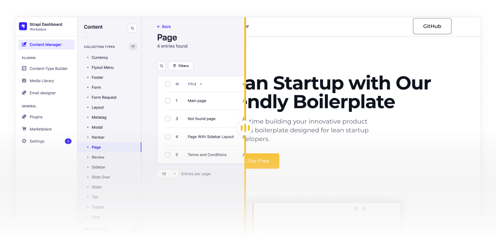

# Boilerplate for Lean Startup Developers

Spend less time on setup and more time building your innovative product with our ready-to-use, feature-packed boilerplate designed for lean startup developers.

### [Documentation](https://sps-lite-documentation.singlepagestartup.com/)

# Minimum Viable Product is Ready

Reduce the time and effort required to build and launch an initial product, helping you validate your ideas and gather customer feedback more quickly. This will allow you to iterate and improve upon your product, increasing your chances of success in the competitive startup landscape.

# Don't repeat yourself

SignlePageStartup is designed to help you efficiently create a MVP that you can launch quickly to gather customer feedback and validate your ideas. Here's what you can expect from the MVP-ready feature.

## Ready-to-Use UI Components

Leverage our pre-built navigation elements, forms, photo galleries, text blocks, CTA elements, and more to create a visually appealing and engaging user experience with minimal effort.

## Global-Ready

Your startup's international expansion is a breeze with our boilerplate's built-in multilingual support. Just select the languages you want to support, and you're good to go.

## Streamlined Authentication & Authorization

Save 20 to 100 hours of development time with our ready-to-use, best-practice authentication and authorization system. Focus on your core features and let us handle the rest.

## Easy Avatar Integration

Enhance user profiles with our pre-built avatar functionality. Simply add the PageBlock to the profile page and let your users personalize their accounts with custom avatars.

## Seamless Third-Party Service Integration

Quickly add essential features to your MVP with built-in support for popular services such as authentication, payment gateways, and analytics tools. Less hassle, more productivity.

## Effortless Document Generation

Generate documents based on user data or completed forms with ease using our built-in document generation functionality. Just incorporate it into your business logic and you're set.

## Comprehensive E-Commerce Features

Utilize our ready-to-use product catalog, product pages, shopping cart, delivery options, and order history to jumpstart your e-commerce project.

## Built-In Blogging Capabilities

Establish your personal brand by enabling our integrated blogging functionality, perfect for sharing news and insights with your audience.

## Flexible Customization and Extensibility

Tailor your project to your needs using the Strapi admin panel, extend its capabilities with plugins, or create your own custom features.

## Hassle-Free Data Migration and Seeding

Easily migrate or seed data by completing your project locally, running a data dump, and migrating it to your server, or by describing your data as JSON and adding it to the data seeding process.

## Rapid Deployment (CI/CD)

With pre-configured deployment tools and processes, our boilerplate enables you to quickly deploy your MVP to your preferred hosting platform. This helps you reduce the time-to-market and start gathering valuable customer feedback sooner.

## Modular and Scalable

Our boilerplate is designed to be easily customizable, allowing you to add, modify, or remove features as needed. This flexibility ensures that you can tailor your MVP to meet the specific requirements of your target customers and adapt it as you learn from their feedback.