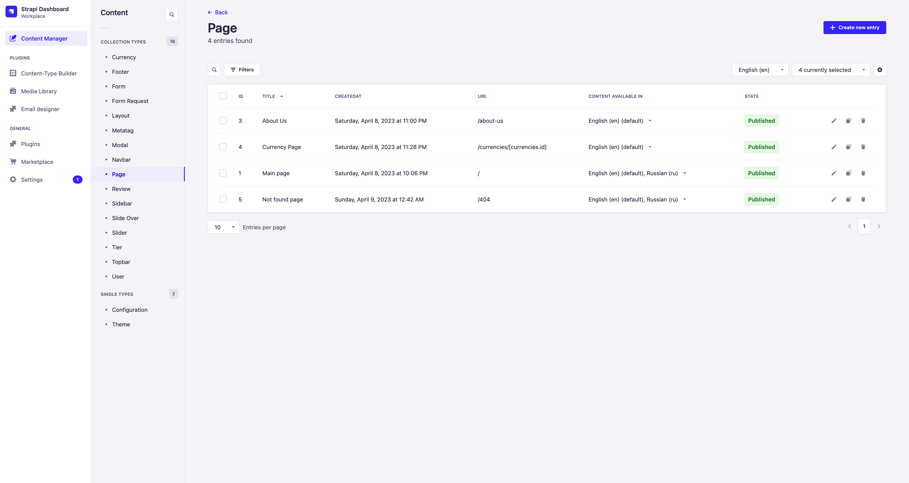

# Creating new page

To create a page on the frontend, it is necessary to create it on the backend. For this purpose, there is a `Page` model.

When creating a new page, the following parameters can be defined:

**title** - the name of the page, not displayed on the frontend, but used for convenience when working on the backend.

**url** - the address at which the created page will be displayed.

**layout** - the layout of the page, determines which navigation menu, footer, sidebar, and other parts of the Layout model are displayed on the page.

**page_blocks** - the page constructor, consisting of Page-Blocks and Elements that are displayed on the page.

**meta_tag** - a meta tag that will be specified in the `<meta>` block of this page

