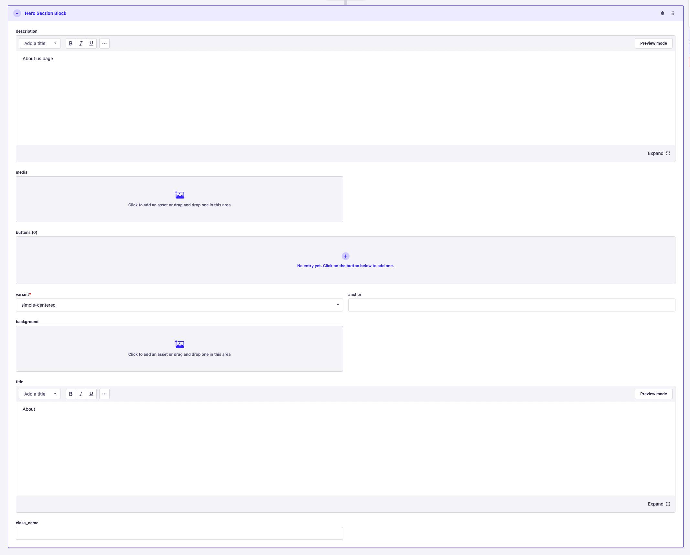
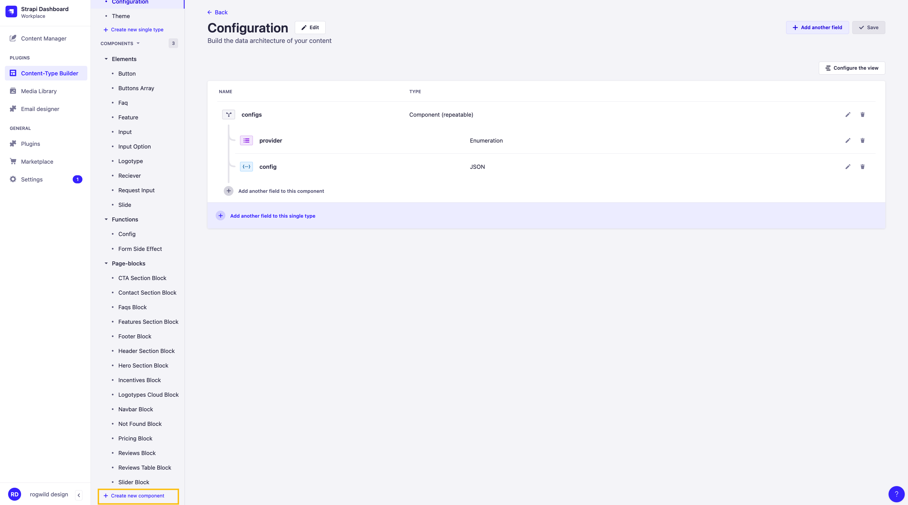
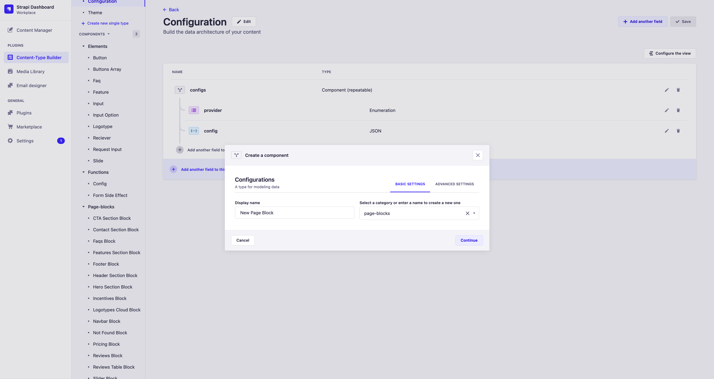
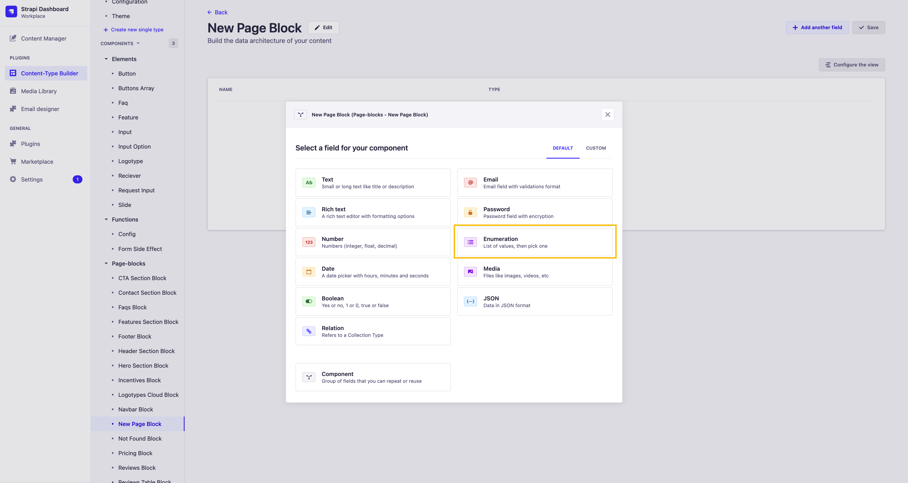
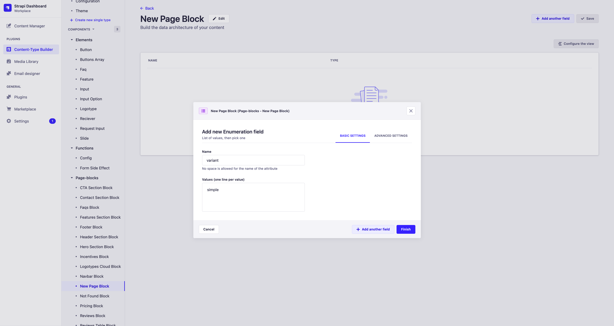
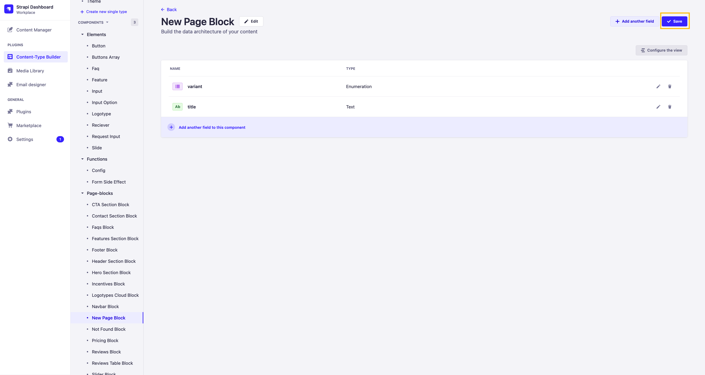
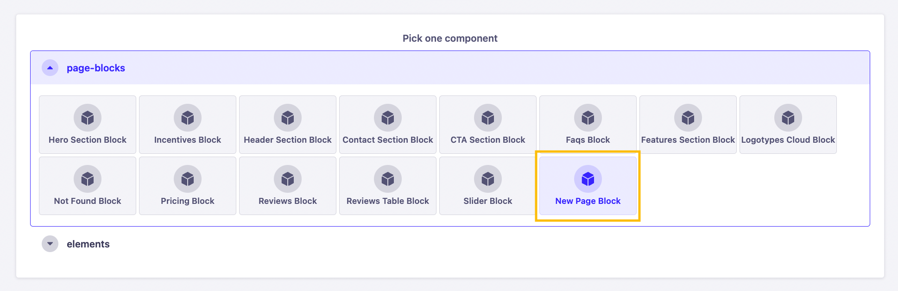

# Working with Page Blocks

Page Blocks concept is a way of describing content and logical elements on the backend and passing them to the frontend. All Page Blocks have a `variant` parameter, which determines how the component will be displayed on the frontend. The logical component of the component on the frontend may also depend on this parameter.

## Data passed to Page-Block

Each Page-Block has its own set of required parameters for display. The `variant` parameter is mandatory in Single Page Startup architecture. The other fields can be optional.

## Creating a new Page-Block

To create a new Page-Block, go to the [Content-Type-Builder](http://localhost:1337/admin/plugins/content-type-builder/content-types/api::configuration.configuration) section and click on the `+ Create new component` button.

After that, in the opened window, you need to enter the name of the new Page-Block in the format `New Page Block` and select `page-blocks` from the drop-down list of options.

Then you need to add a mandatory `Enumeration` field with the name `variant`.

After that, necessary fields can be added if needed and the Page-Block can be saved by clicking on the `Save` button.

## Connecting a new Page-Block to models

After creating a new Page-Block, it is necessary to connect it to the model, for example, to the `Page` model. To do this, go to the [Content-Type-Builder](http://localhost:1337/admin/plugins/content-type-builder/content-types/api::page.page) section of the Page model and add the created Page-Block to the Dynamic-Zone field `page_blocks`. You can connect that page block to every model that has a `page_blocks` Dynamic-Zone field, such as Navbar, Sidebar, Modal, and Footer.

After completing these steps, the created Page-Block will be available for selection in the `page_blocks` field when creating or editing a page.

