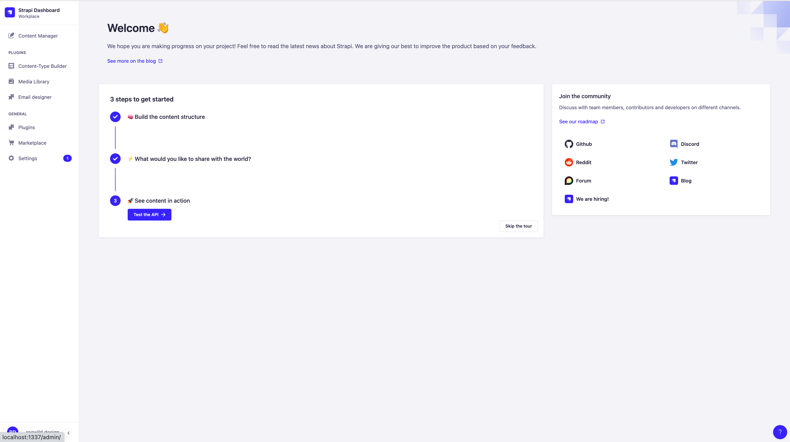

# Backend

On the backend of the project, [Strapi](https://strapi.io/) is used. You can find the main information on how to work with this solution in the [Official Documentation](https://strapi.io/documentation/developer-docs/).

