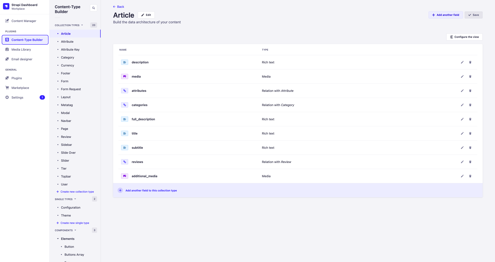
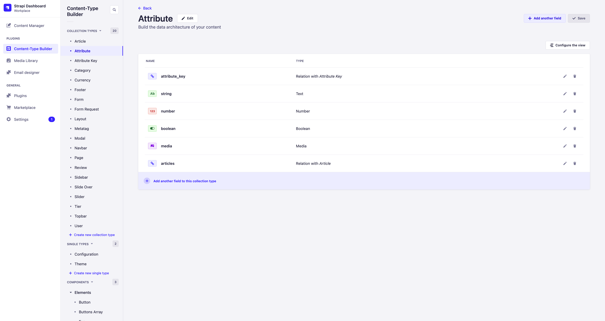
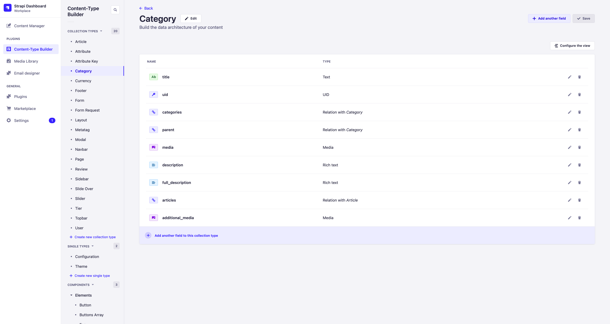
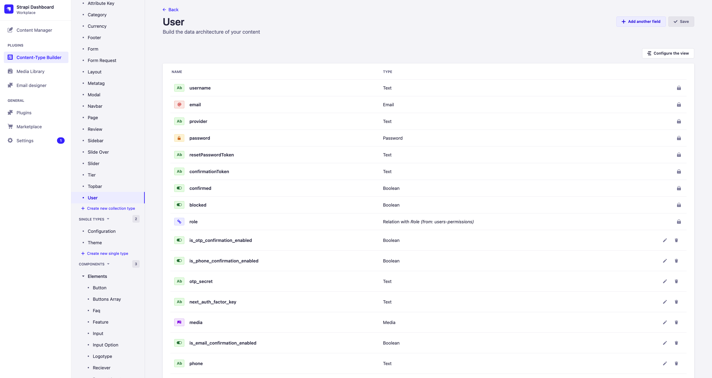
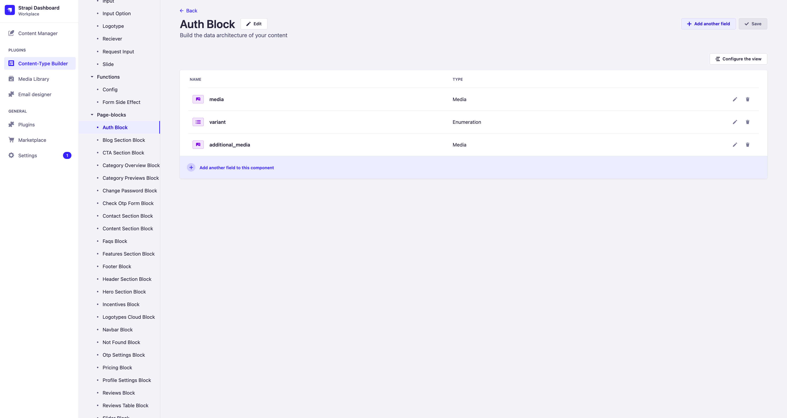
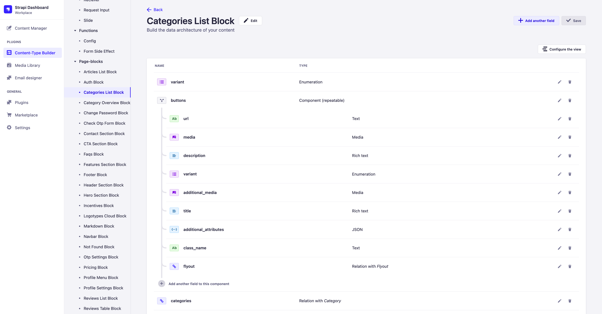
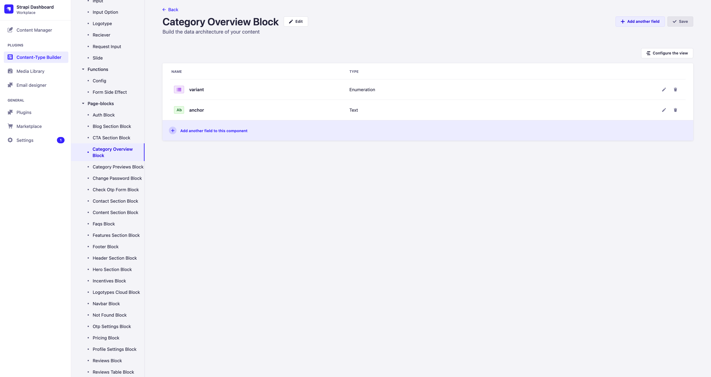
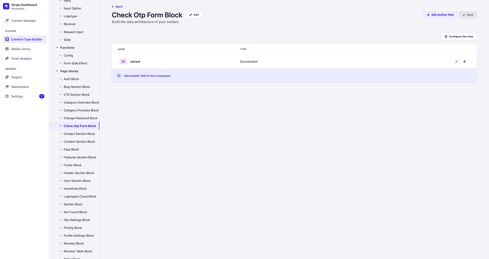
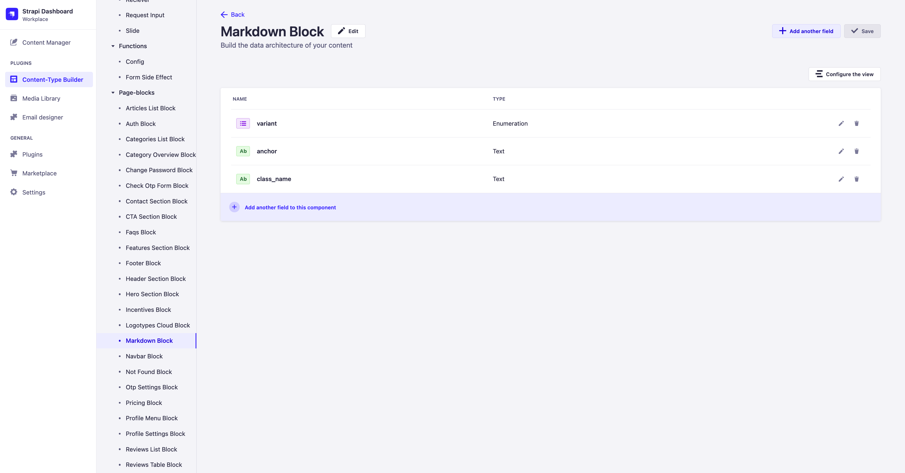
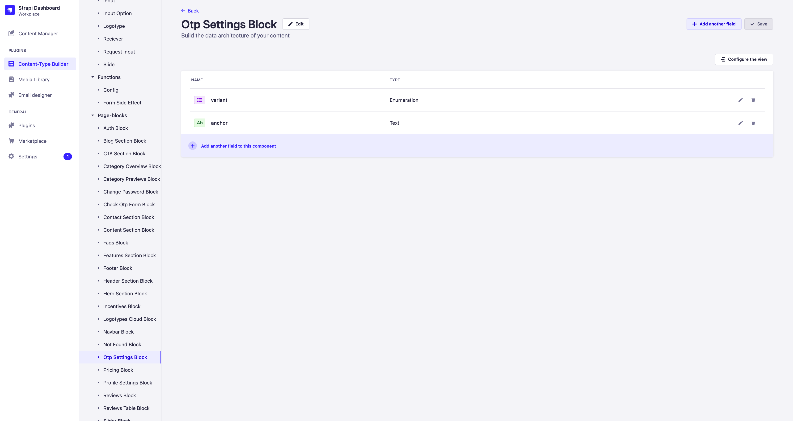

# Models

Version `sps` includes all `sps-lite` models, as well as models that add the logic for authorization, authentication, and models related to blog functionality.

## Collection Type

### Article

Модель статьи блога.

### Attribute

Attribute model for creating article parameters, such as reading time.

### Attribute Key

Attribute key model, in case of creating a read time attribute, is `read-time`. This model is needed to normalize data and can later be used for filter builders on the frontend.

### Category

Category model.

### User

Advanced user model

## Components

### Page-blocks

#### Articles list block

Block with article cards

#### Auth Block

Authentication and user authorization block

#### Categories List Block

Category cards block

#### Category Overview Block

#### Change Password Block

#### Check Otp Form Block

#### Markdown Block

Content zone for the `Article` model

#### Otp Settings Block

#### Profile Settings Block

