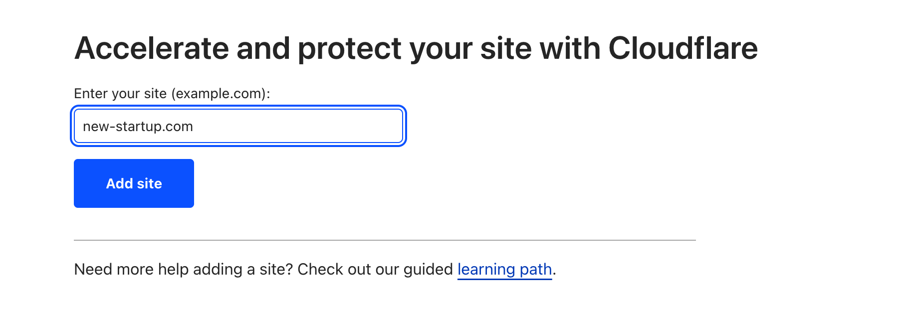
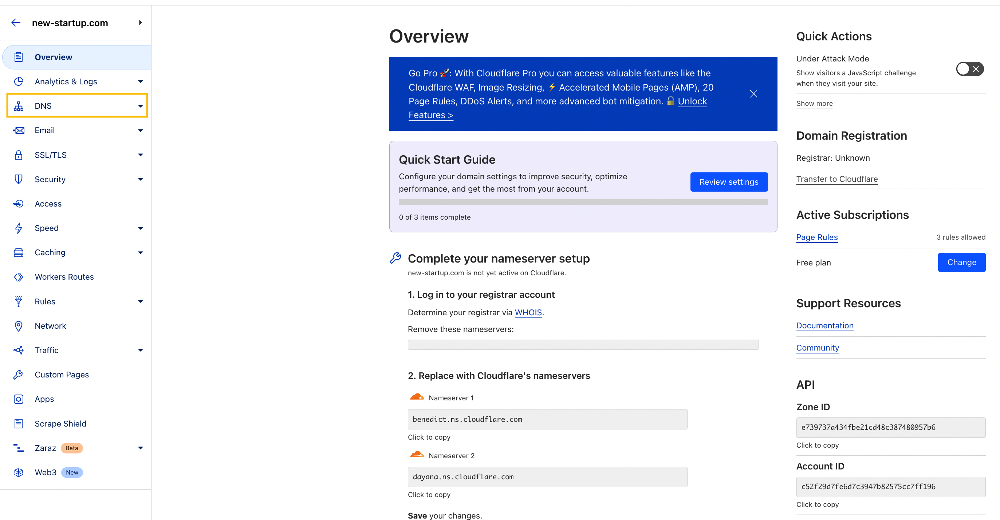
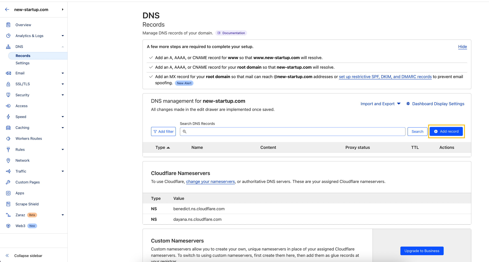
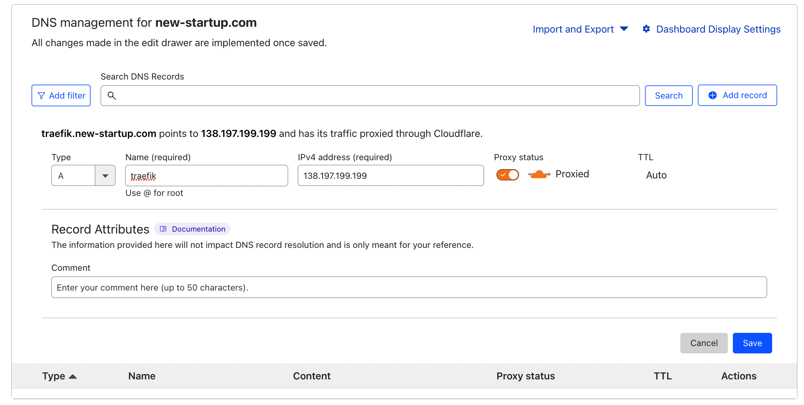
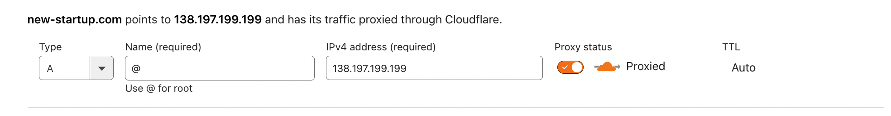
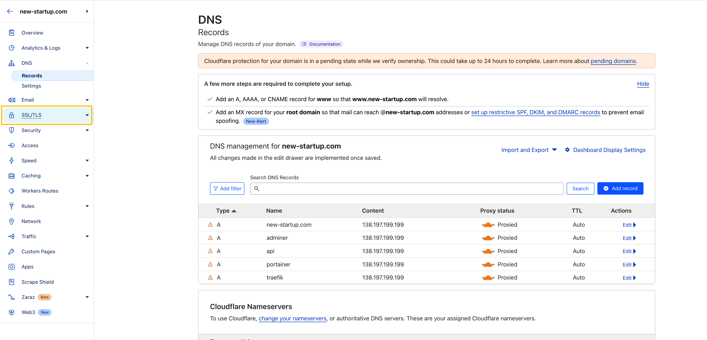
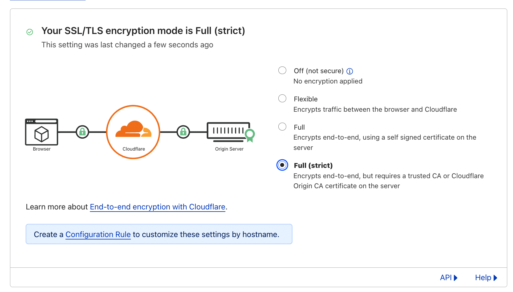
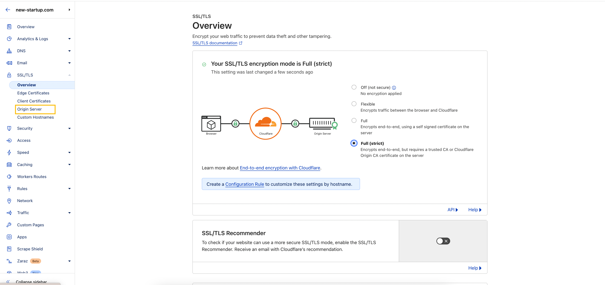
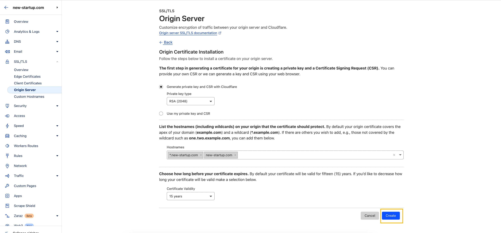
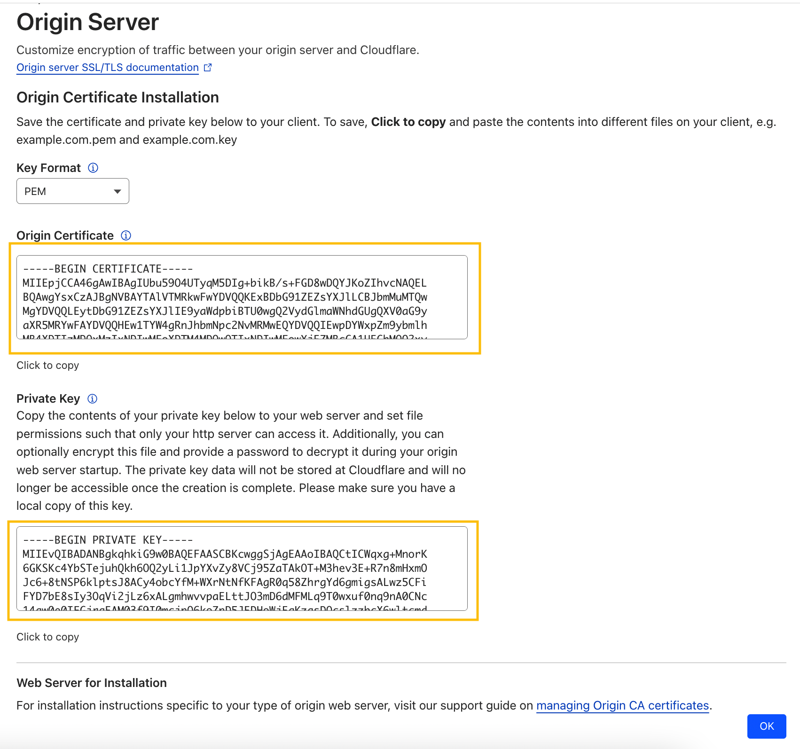

# SSL-certificates

Before obtaining certificates, you need to purchase a domain for your project. This can be done on services such as [Google Domains](https://domains.google/), [Namecheap](https://www.namecheap.com/), [GoDaddy](https://www.godaddy.com/), and others.

## Cloudflare

We recommend using [Cloudflare](https://cloudflare.com/) to manage your domain's `SSL certificates` and `DNS records`. To do this, you need to create an account there and delegate your domain to their `DNS servers`.

To delegate your domain to Cloudflare's servers, simply follow the steps described in the Cloudflare domain administration panel.

### Add a domain

### Choose the Free plan

### Add nameservers in the administrative panel where you purchased the domain

After completion, click on the `Done, check nameservers` button. It may take some time for the changes to the NS servers to take effect.

Once the changes take effect, you will be able to edit DNS records and issue SSL certificates through Cloudflare.

## **Adding DNS Records**

Through Cloudflare, you can manage domain DNS records. DNS records allow the browser to determine where to direct user traffic when they try to visit your project on the internet.

You need to add several DNS records to allow visitors to use your project. We will need subdomains for `traefik`, `portainer`, `adminer` (optional), `backend`, `frontend`.

To do this, go to the DNS section in the Cloudflare administration panel sidebar.

Next, you need to click on the `Add record` button

Afterwards, you need to add several records of type `A` with proxying enabled through Cloudflare. In the fields that appear, we should enter the subdomain name where we want to see a particular service and the `server IP address` that we configured in the `Server configuration` section.

We also entered the server's `IP address` in the `SSH console`, so we can take it from there.

When entering the above parameters, we got the following result:

We told the domain registrar that the domain is managed by Cloudflare, so route user traffic to Cloudflare's NS servers.

We told Cloudflare that when receiving a request from the user to the address `traefik.new-startup.com`, route all traffic to the server located at `IP address: 138.197.199.199`.

We add the rest of the domains in the same way.

To route the domain itself somewhere, enter `@` in the `Name (required)` input field.

Ultimately, the result should be something like this (subdomains can be chosen at your discretion):

## Obtaining an SSL Certificate

After we have defined the domain routing for the project, it is necessary to obtain an SSL certificate and configure the method of its verification. To do this, you need to go to the `SSL/TLS` section.

Choose `Full (strict)`

Go to the `Origin Server` section

Click on `Create certificate`.

Confirm the creation of certificates `Create`

Copy the `Origin Certificate` and save its contents in a file with the domain name and extension `.crt`, for example `new-startup.com.crt`. Save the Private Key \*\*\*\* in the same way, but with the extension `.key`. Then click `OK`. Later, these files will need to be placed on the server in the `certs` folder, which will be described in the `Docker Swarm` section.

