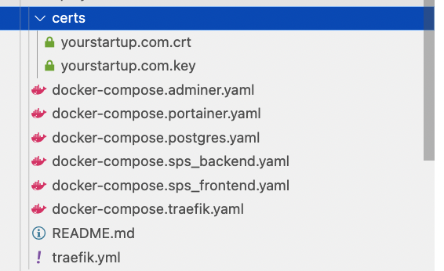
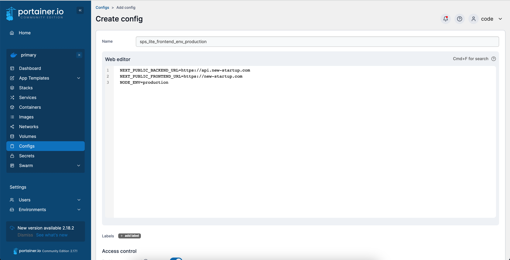

# Docker Swarm

## Connecting to the server as user "code"

If the user is not created, it is necessary to follow the steps described in `Server configuration`.

## Creating a Docker Swarm

To configure Docker Swarm, you can use the [official documentation](https://docs.docker.com/engine/swarm/swarm-tutorial/create-swarm) or simply create a Swarm Manager by executing the command:

```bash title="in any folder"
docker swarm init
```

After creating a `Docker Swarm`, you can proceed to configuring the environment in which the project will work.

## Environment configuration

The Single Page Startup repository contains a `deployment` directory that contains all the necessary `docker-compose` files.



All the commands listed below must be executed in the `code` directory, which we created in the root directory of the server.

## Traefik

To configure Traefik, you need to create a `docker-compose.traefik.yaml` file and a `traefik.yml` configuration file. In the `docker-compose.traefik.yaml` file, you need to replace the field `Host(\`traefik.yourstartup.com\`)`according to the domain and subdomain that was specified during the`DNS records`setup in the`SSL certificates` section.

To create a password for the Traefik administration panel, you need to add it to the `docker-compose.traefik.yaml` file.

```bash title="in any folder"
echo $(htpasswd -nb user password) | sed -e s/\\$/\\$\\$/g
			 	    |    |
			 	    |    └ replace with the required password
			 	    └ replace with the required name
```

It is also necessary to place the certificates obtained during the execution of the section `SSL-certificates` in the `certs` folder.

```bash
certs
├ <domain_name>.crt
└ <domain_name>.key
```

To launch Traefik, execute the command:

```bash title="in folder with docker-compose files"
docker stack deploy -c=docker-compose.traefik.yaml traefik
```

After a successful launch, the management panel for Traefik should become available at the address `traefik.<your_domain.com>`.


## Portainer

You need to create a file named `docker-compose.portainer.yaml` and a directory named `portainer_data`. In the `docker-compose.portainer.yaml` file, replace the field `Host(\`portainer.yourstartup.com\`)`with the domain and subdomain that were specified during the setup of DNS records in the`SSL-certificates` section.

After that, start them in the service command line.

```bash title="in folder with docker-compose files"
docker stack deploy -c=docker-compose.portainer.yaml portainer
```

After a successful launch of `Portainer`, it should be accessible at `portainer.<your_domain.com>` address.


## Postgres

Create a directory called `postgres_data` and a file named `docker-compose.postgres.yaml`.

```bash title="in folder with docker-compose files"
docker stack deploy -c=docker-compose.postgres.yaml postgres
```

## Adminer

It is necessary to create a file named `docker-compose.adminer.yaml`. In the file `docker-compose.adminer.yaml`, the field `Host(\`adminer.yourstartup.com\`)`should be replaced according to the domain and subdomain specified during the configuration of`DNS records`in the steps outlined in the`SSL-certificates` section.

```bash title="in folder with docker-compose files"
docker stack deploy -c=docker-compose.adminer.yaml adminer
```

After a successful launch, Adminer should be available at `adminer.<your_domain.com>`.


## Backend

It is necessary to create the `sps_backend_uploads` directory, `docker-compose.sps_backend.yaml`, and `sps-lite.env` files.

In the `sps-lite.env` file, all parameters should be set according to your configuration.

In the `docker-compose.sps_backend.yaml` file, the `environment` parameters should be replaced according to your configuration, and the `Host(\`api.yourstartup.com\`)`field should be changed to the domain and subdomain specified during the`DNS records`setup in the`SSL-certificates` section.

The service can be launched with the following command:

```bash title="in folder with docker-compose files"
docker stack deploy -c=docker-compose.sps_backend.yaml sps_backend
```

## Frontend

It is necessary to create a file named `docker-compose.sps_frontend.yaml`. In the `docker-compose.sps_frontend.yaml` file, the field `Host(\`yourstartup.com\`)`needs to be replaced with the domain and subdomain specified during the configuration of`DNS records`in the steps of the`SSL-certificates` section.

The service can be launched with the following command:

```bash title="in folder with docker-compose files"
docker stack deploy -c=docker-compose.sps_frontend.yaml sps_frontend
```

Frontend configuration parameters are taken from the `/frontend/.env.production` file, but they can be overwritten using Portainer. To do this, create a new entry in the `Config` section.




The created configuration file should be installed in the `sps_frontend` service under the `Config` section with the `Path in container` parameter set to `/usr/src/app/.env.production`. Then, click on the `Apply changes` button and restart the service by clicking on the `Update the service` button.


