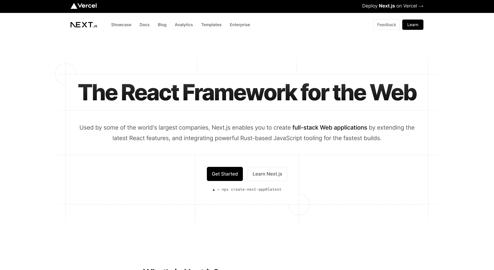
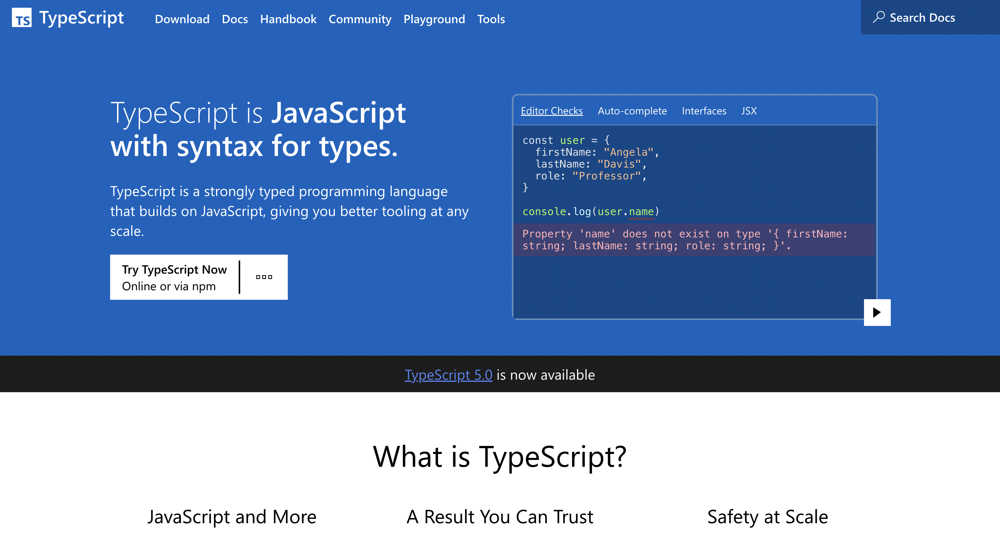
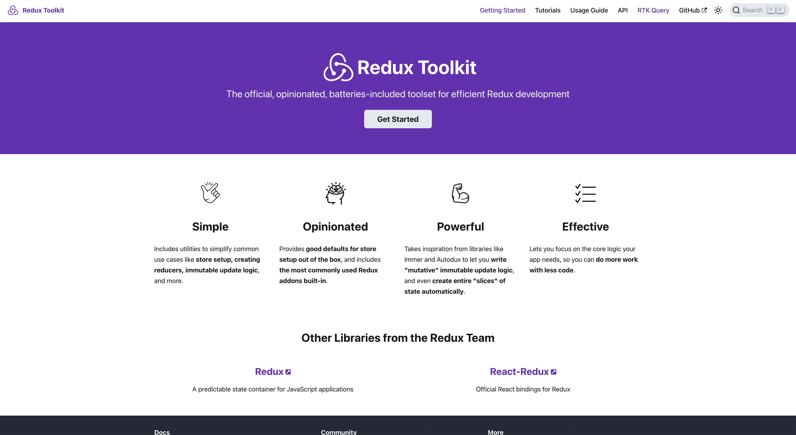
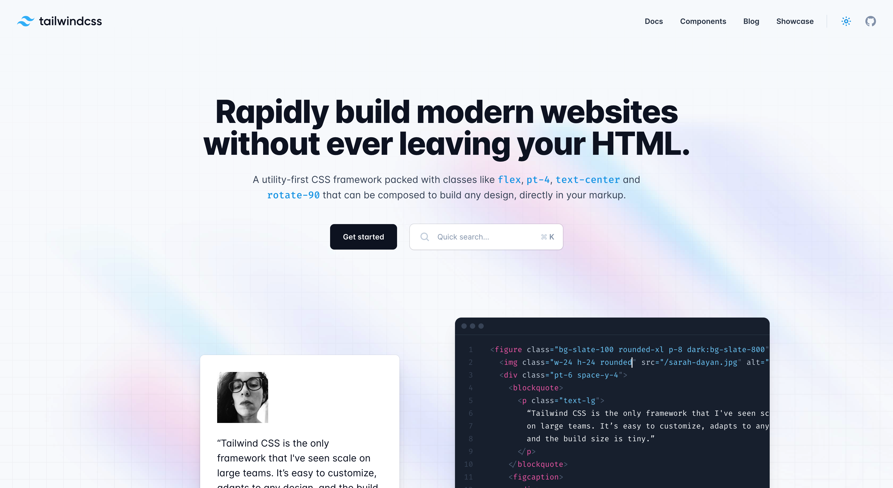
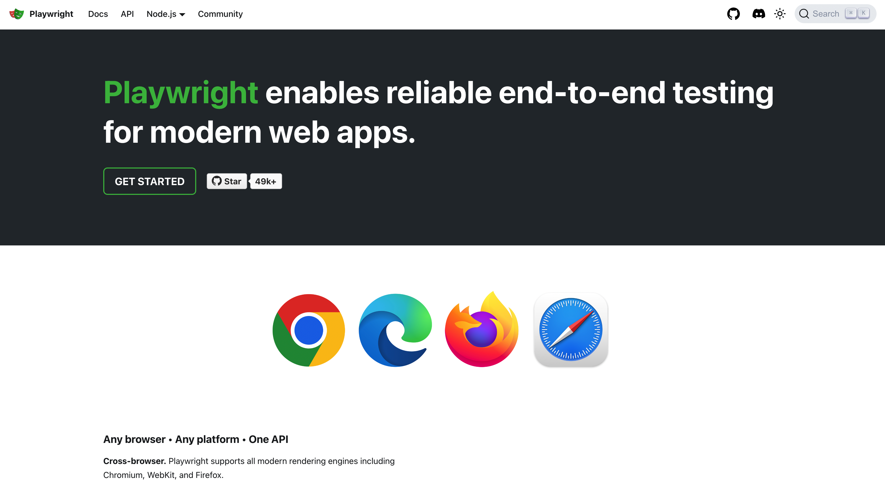

# Frontend

We have identified a list of the most commonly used technologies in application development and consolidated them. All of them are configured and available in Single Page Startup.

## [Next.js](https://nextjs.org)

The framework included in this project is a powerful tool for creating interfaces on [React.js](https://reactjs.org/) with server-side rendering (SSR).

It offers a wide variety of features, including built-in routing for easy navigation, client-side and server-side rendering functionality for enhanced performance, built-in image optimization for faster loading times, and much more. With this framework, users can easily create dynamic and responsive interfaces that are both visually appealing and highly functional.

Additionally, the framework is designed to be highly customizable, allowing users to tailor their interfaces to their specific needs and preferences. This framework represents a major step forward in the world of web development, and is sure to be a valuable tool for developers of all skill levels.

## [TypeScript](https://typescriptlang.org)

TypeScript is a strictly typed programming language that is based on JavaScript. It provides superior tools that can be used for any scale of application development. TypeScript allows for more secure and reliable code by catching errors at compile-time, rather than at runtime.

This helps to reduce the number of bugs and makes it easier to maintain and refactor code. Additionally, TypeScript offers a range of features that are not available in plain JavaScript, such as interfaces, classes, and static typing. These features can help developers to write more organized, maintainable, and scalable code.

Overall, TypeScript is a powerful tool that can be used to improve the quality and efficiency of software development.

## [Redux-Toolkit (RTK)](https://redux-toolkit.js.org/rtk-query/overview)

This is the official toolkit that has been designed to facilitate efficient work with [Redux](https://redux.js.org/). Developed by a team of experienced developers, this toolkit aims to provide a comprehensive and robust solution that can be used to streamline workflows, boost productivity, and simplify the development process.

With a wide range of powerful features and tools, this toolkit is ideal for developers who want to take their Redux development to the next level. Whether you are an experienced developer or a beginner, this toolkit is easy to use and can help you achieve your goals in no time.

## [Tailwind CSS](https://tailwindcss.com)

Tailwind CSS is a popular framework for designing user interfaces that allows you to easily create dynamic and responsive interfaces that are both visually appealing and highly functional. It is built on a set of pre-defined classes, each of which describes a single CSS parameter. This approach enables developers to quickly and efficiently create custom interfaces without having to write complex CSS code from scratch.

Tailwind CSS is highly customizable and offers a wide range of features, including built-in image optimization for faster loading times, responsive design capabilities, and more. It is also designed to be highly accessible, with a focus on creating fully accessible user interfaces that can be used by all users, including those with disabilities.

## [Headless UI](https://headlessui.com)

Headless UI provides a set of completely unstyled, yet fully accessible UI components that have been created specifically for easy integration with Tailwind CSS. These components are designed to be highly customizable, allowing developers to easily tailor them to their specific project requirements and preferences.

By using Headless UI, developers can save time and effort by not having to worry about styling and accessibility, and instead focus on building great user experiences. The components are built with accessibility in mind, ensuring that they can be used by all users, including those with disabilities.

## [React Hook Form](https://react-hook-form.com)

Is a React library that uses React Hooks to manage form state and validation. It is a popular choice for React developers because it is easy to use, performant, and extensible. React Hook Form provides a number of features that make it a powerful tool for managing forms, including state management, validation, and extensibility. If you are looking for a powerful and easy-to-use form library for React, React Hook Form is a great option.

## [Storybook](https://storybook.js.org/)

The React.js application is designed to provide users with a way to display parts of the user interface in an environment that is isolated from the main business logic of the project. By doing so, developers are able to create more modular and flexible interfaces that can be easily customized to meet the specific needs and preferences of their users.

This application is particularly useful for developers who are looking to build complex and dynamic user interfaces that require a high degree of flexibility and scalability. With the ability to isolate parts of the user interface from the main business logic of the project, developers are able to create interfaces that are more responsive, performant, and easier to maintain over time.

## [Playwright](https://playwright.dev)

Playwright is a powerful and flexible framework for end-to-end testing of user applications. With Playwright, developers can easily create automated tests that simulate user behavior and interaction with the application, helping to ensure that the application is working as intended and delivering a high-quality user experience.

Also it offers a range of powerful features and tools, including cross-browser and cross-platform support, advanced debugging capabilities, and more. Whether you are a seasoned developer or just getting started with end-to-end testing, Playwright is a valuable tool to have in your arsenal.

