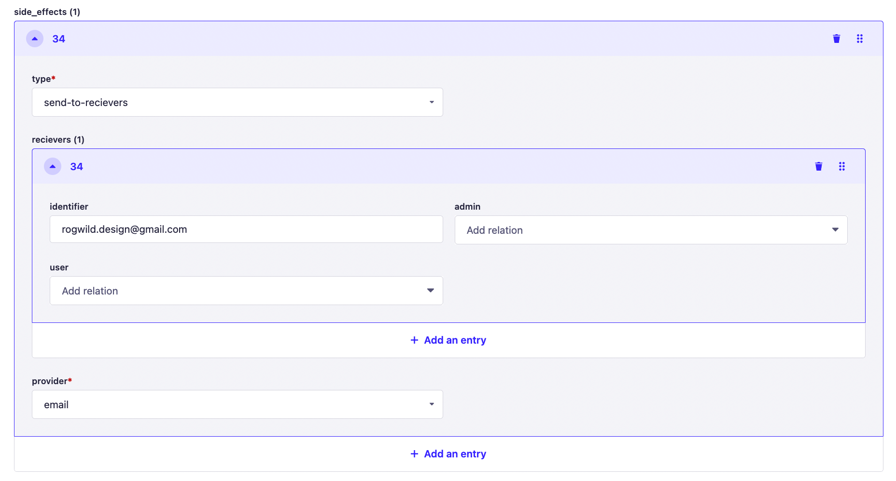
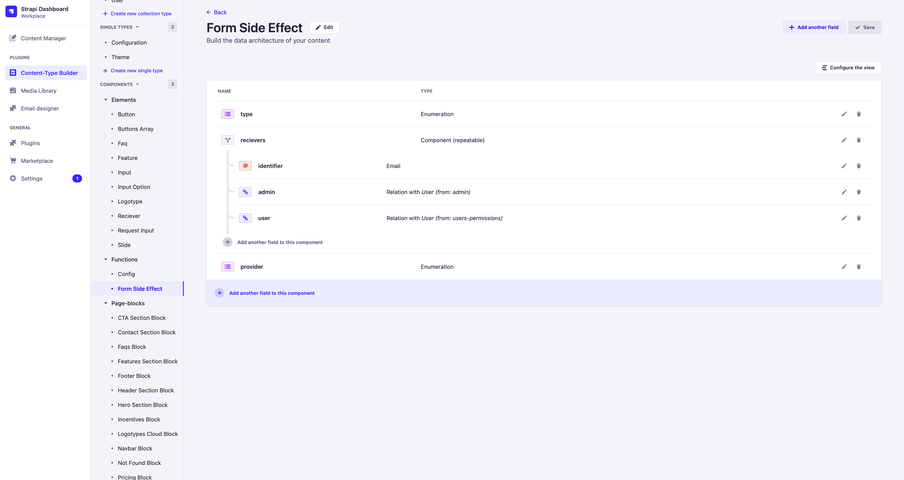

# Connecting the feedback form

To connect a feedback form, you need to create a record in the `Form` model and configure its side effects. To do this, go to the `Form` model page and create a record.


When creating a new record, there are fields that determine the display characteristics of the form and its logic.

- `inputs` - fields displayed in the form
  - `placeholder` - placeholder in the input form
  - `variant` - Input component variant used on the frontend
    - `text` - text input, must have type `text` or `textarea`
    - `listbox` - drop-down list, can be `multiple`, must have a filled **options** field
    - `radio-group` - radio buttons
    - `switch` - checkbox
    - `file` - input for uploading files
    - `range` - slider input
    - `date` - date or date with time selector, must have type `date` or `datetime`
  - `is_required` - field requirement
  - `value` - initial value, if required
  - `name` - input field name, used for further placement in the `key` field of the `Form Request` model
  - `options` - options for selection, if **variant** `listbox` or `radio-group` is selected.
  - `label` - name displayed above the input field
  - `class_name` - additional class for styling
  - `type` - type, if required and supported by the selected variant
  - `multiple` - multiple field or not (if supported by the selected variant)
  - `min` - minimum value (if supported by the selected variant)
  - `max` - maximum value (if supported by the selected variant)
  - `step` - step (if supported by the selected variant)
- `button` - button for submitting the form, it will contain the `onClick` method to submit the form
- `uid` - form identifier
- `side_effects` - side effects responsible for subsequent actions that will be performed after the user submits it

## Side Effects

Form builder has a functionality to configure actions that will be triggered after it is submitted by the user on website pages. These actions are called `Side Effects`. Currently, there are several options for `Side Effects`.

### Send an email

An action that sends form data to recipients specified in the `recievers` field. To send form data to email, the following fields must be filled with the following data.

To configure this side effect, you need to set the following parameters. For each recipient, you can only select one of the parameters `admin`, `user`, or `identifier`. If the `Form Request` needs to be sent to multiple recipients, then you need to add multiple `receivers`, which can be done by clicking on the `+ Add an entry` button.

- `type` - you need to select `send-to-receivers`
- `admin` - you can select an administrator from those registered in the Strapi administration panel
- `user` - you can select a user registered on the website through the client-side
- `identifier` - explicit indication of the email address to which to send the `Form Request`



### Save data as a PDF file

An action that saves user-entered data as a PDF file to local storage or Google Drive.

To save a PDF file to the backend's local storage, the following parameters must be set:

- `type` - `save-as-pdf`
- `provider` - `local`. If S3 storage is configured, the created file will be uploaded there.

To save a PDF file to Google Drive, the following parameters must be set:

- `type` - `save-as-pdf`
- `provider` - `google-drive`


### Send data to Google Sheets

An action that saves user-entered data to Google Sheets.

To set up this action, the following parameters must be specified:

- `type` - `pass-to-service`
- `provider` - `google-sheets`

To save data to `Google Sheets`, a `Configuration` for Google must be added.


### Adding a new Side Effect

To add a new `side-effect`, you need to add a function responsible for performing this action and the parameters necessary for selecting this `side-effect` in the administration panel.

#### Adding a Function

`side-effect` functions are stored in the directory `./backend/src/side-effects`. The file `./backend/src/side-effects/index.js` is responsible for selecting the function to be called.

```javascript title="./backend/src/side-effects/index.js"
const saveAsPdf = require("./save-as-pdf");
const sendToRecievers = require("./send-to-recievers");
const passToService = require("./pass-to-service");

async function sideEffectsEmmiter({ event, sideEffect, payload }) {
  if (sideEffect.type === "send-to-recievers") {
    await sendToRecievers({ event, sideEffect, payload });
  } else if (sideEffect.type === "save-as-pdf") {
    await saveAsPdf({ event, sideEffect, payload });
  } else if (sideEffect.type === "pass-to-service") {
    await passToService({ event, sideEffect, payload });
  }
}

module.exports = sideEffectsEmmiter;
```

To add a new `side-effect`, it is necessary to add a new type and function.

```javascript title="./backend/src/side-effects/index.js"
...
const newIntegration = require("./new-integration.js");

async function sideEffectsEmmiter({ event, sideEffect, payload }) {
  if (sideEffect.type === "send-to-recievers") {
    ...
  } else if (sideEffect.type === "new-integration") {
    await newIntegration({ event, sideEffect, payload })
  }
}

module.exports = sideEffectsEmmiter;
```

A new feature is added as a file, similar to the file `./backend/src/side-effects/send-to-recievers.js`.

```javascript title="./backend/src/side-effects/new-integration.js"
async function newIntegration({ event, sideEffect, payload }) {
    ...
}

module.exports = newIntegration;
```

These are the parameters that are passed to this function:

- `payload` - data from the filled out form
- `sideEffect` - data entered by an administrator when filling out the `side_effects` field in the `Form` model
- `event` - Strapi lifecycle [event](https://docs.strapi.io/dev-docs/backend-customization/models#lifecycle-hooks)

#### Adding Side Effect Parameters

In order for the administrator to be able to choose a new `side-effect`, it is necessary to add its key and additional parameters (if necessary) to the `Content-Type-Builder` of the [Form Side Effect component](http://localhost:1337/admin/plugins/content-type-builder/component-categories/functions/functions.form-side-effect).



It is necessary to add a key that determines the selection of this `side-effect` in the administration panel, in our case this key is `new-integration`


