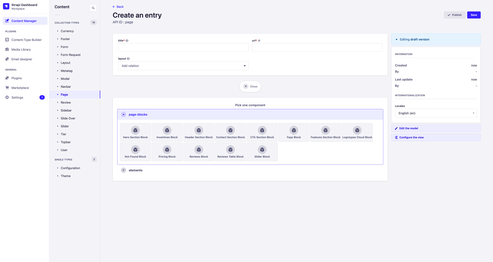

# Создание страницы

Для создания страницы на фронтенде нужно создать её на бекенде. Для этого имеется модель Page.

При создании новой страницы можно определить:

- **title** - название страницы, не отображается на фронтенде, нужно для удобства работы на бекенде
- **url** - адрес, по которому будет отображаться созданная страница
- **layout** - разметка страницы, определяет то, какое навигационное меню, футтер, сайдбар и другие чати модели Layout отображаются на странице
- **page_blocks** - конструктор страницы, Page-Block'и и Element'ы отображаемые на странице

