# Разработка

## Панель адмнистрирования

После запуска проекта станет доступна панель администрирования по адресу [http://127.0.0.1:1337/admin](http://127.0.0.1:1337/admin). При первом посещении необходимо создать администратора.

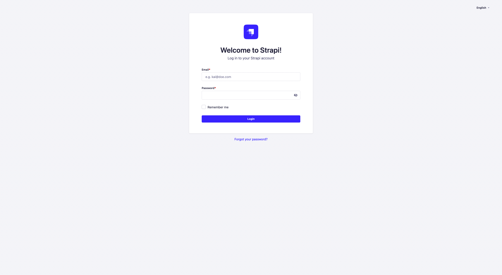

После создания пользователя и входа в аккаунт откроется главная страница панели администрирования Strapi. Подробную информация о том что такое Strapi можно узнать в [Официальной документации](https://docs.strapi.io/dev-docs/quick-start).

## Модели

Для того, чтобы ознакомиться с моделями, которые уже созданы в Single Page Startup нужно перейти в раздел `Content-Type-Builder`

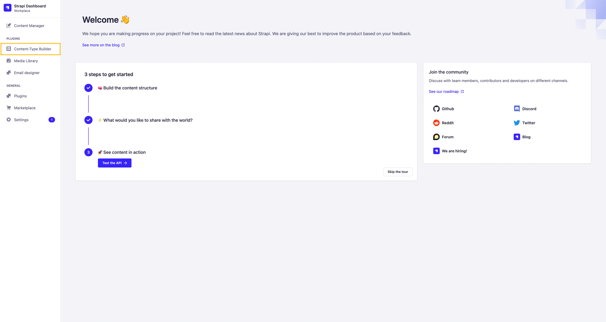

На открывшейся страницы показано какие модели и связи имеются в проекте.

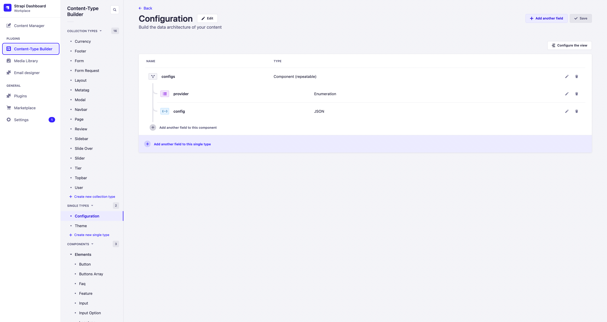

### Collection Type

Модели, которые являются основой бизнес логики проекта, либо должны быть связаны с другими моделями.

#### Currency

Модель валют, используется в `Tiers Page Block` и участвует в бизнес логике проектов, наследуемых от `sps-lite`.

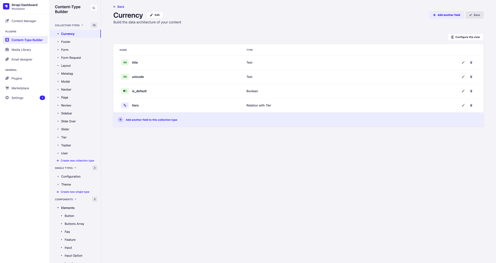

#### Footer

Модель контейнера футера, который используется на страницах проекта. В него помещается Page-Block `Footer Block`. Вынесен в модель потому что может повторяться в разных `Layout` и может быть мультиязычным.

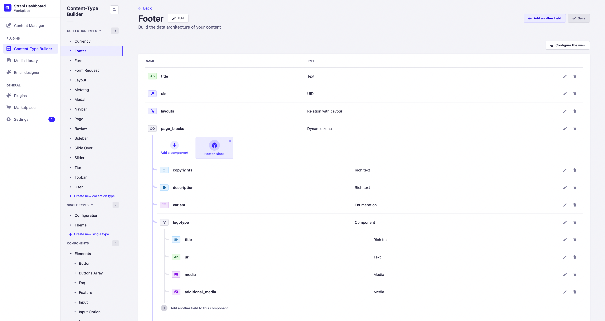

#### Form

Конструктор форм, может быть мультиязычной и повторяться в разных Page-Block.

#### Form Request

Модель, экземпляр которой создается после того, как пользователь заполнил и отправил форму на фронтенде. Участвует в сайт-эффектах на отправку формы, так как данные в сайд-эффекты передаются из нее.

#### Layout

Модель, на основе которой отображается страница на фронтенде. Является связующим звеном частей страницы - `Navbar`, `Footer`, `Modal` и других.

#### Metatag

Модель участвующая в формировании `meta-тегов` страниц сайта.

#### Modal

Конструктор модальных окон, используемых на сайте.

#### Navbar

Модель контейнера навигационного меню, который используется на страницах проекта. В него помещается Page-Block `Navbar Block`. Вынесен в модель потому что может повторяться в разных `Layout` и может быть мультиязычным.

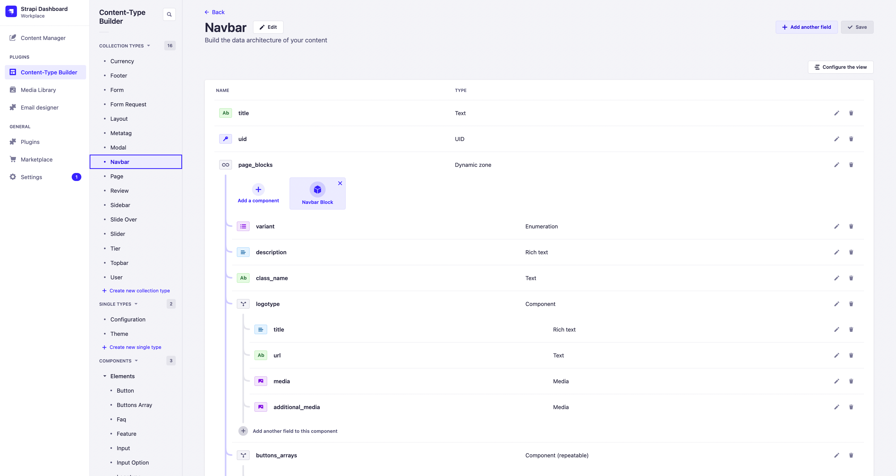

#### Page

Модель страниц, создавая новые экземпляры данной модели создаются страницы, которые будут доступны на фронтенде по адресу, указанному в `url` создаваемого экземпляра.

#### Review

Модель отзывов, используется в Page-Block `Reviews Block` и `Reviews Table Block`.

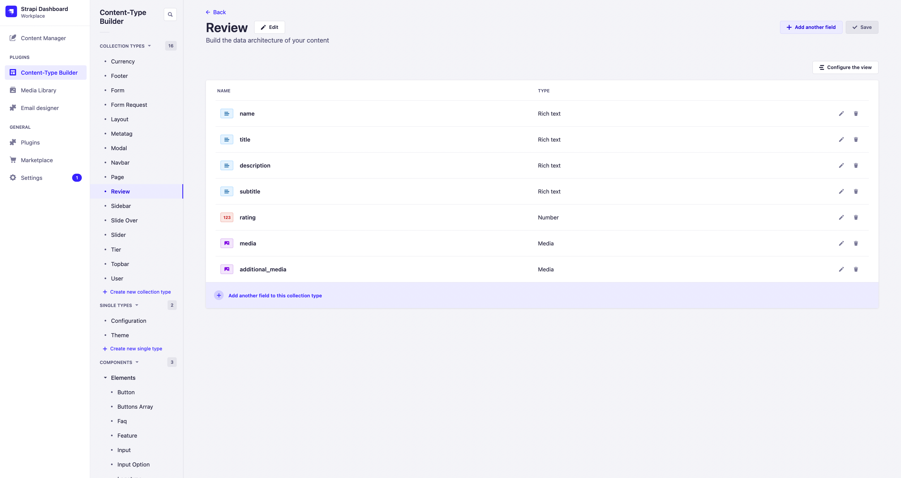

#### Sidebar

Модель контейнера сайдбара, который используется на страницах проекта. Вынесен в модель потому что может повторяться в разных `Layout` и может быть мультиязычным.

#### Slide Over

Модель выезжающего блока с контентом. Вынесен в модель потому что может повторяться в разных `Layout` и может быть мультиязычным.

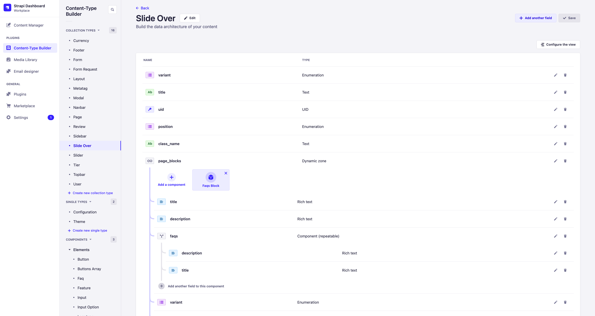

#### Slider

Конструктор для слайдера с контентом.

#### Tier

Модель уровня подписки, используется в `Tiers Page Block` и участвует в бизнес логике проектов, наследуемых от `sps-lite`.

#### Topbar

Модель контейнера топбара, который используется на страницах проекта. Вынесен в модель потому что может повторяться в разных `Layout` и может быть мультиязычным.

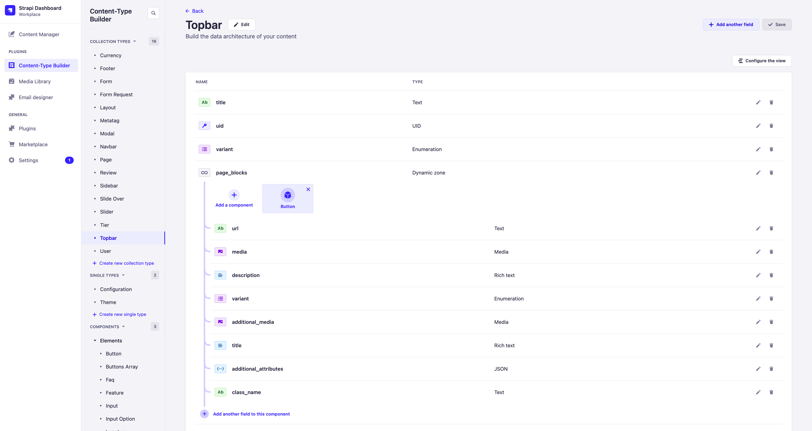

#### User

Модель пользователя, является стандартной моделью `Users-Permissions Plugin`.

### Single Type

#### Configuration

Модель для настройки конфигурации сайд-эффектов.

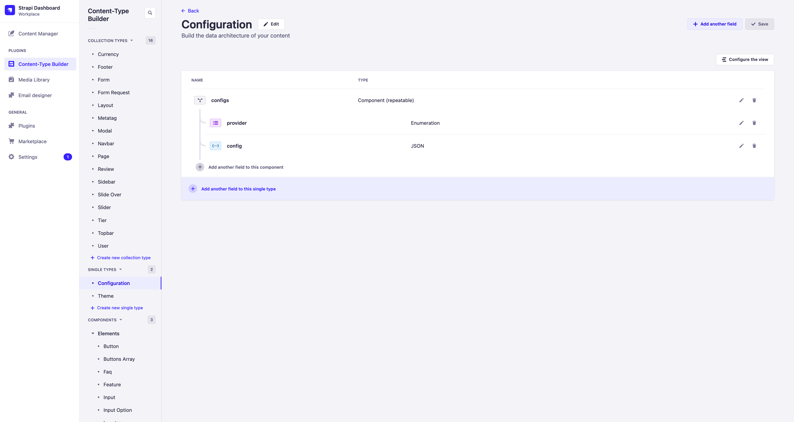

#### Theme

Модель для настройки цветовых токенов интерфейса.

### Components

#### Elements

##### Button

Компонент кнопки

##### Buttons Array

Компонент для выпадающего списка с кнопками либо просто списка кнопок

##### Faq

Компонент для элемента FAQ, используемого в Page-Block `Faq Block`

##### Feature

Компонент для элементов, используемых в Page-Block'ах `Features Section Block`, `Incentives Block`.

##### Input

Компонент, используемый в конструкторе форм модели [Form](/docs/backend/development/#form).

##### Input Option

Компонент варианта, используемый в поле ввода конструктора форм модели [Form](/docs/backend/development/#input).

##### Logotype

Компонент логотипа, используется в Page-Block'ах `Footer Block`, `Navbar Block` и `Logotypes Cloud`.

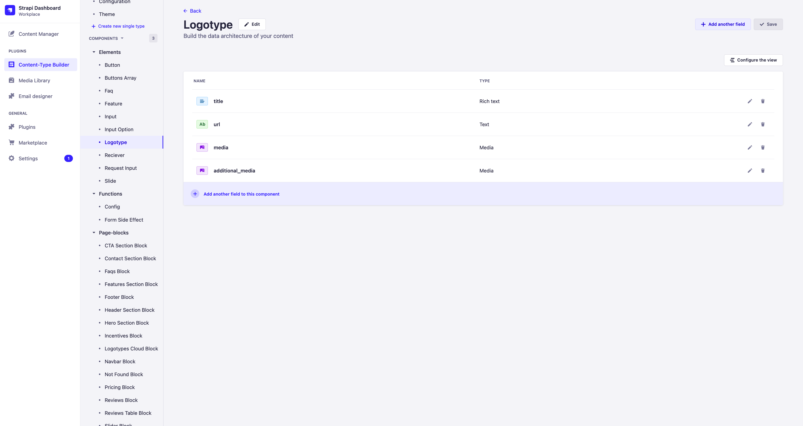

##### Reciever

Получатель результата сайт-эффекта при взаимодействии с моделью [Form](/docs/backend/development/#input).

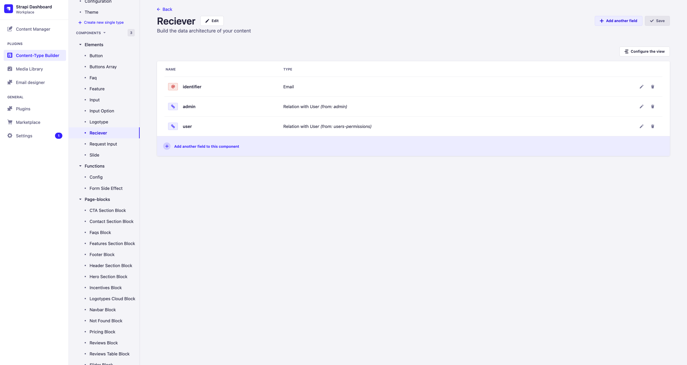

##### Request Input

Компонент, используемый при построении экземпляра [Form Request](/docs/backend/development#form-request).

##### Slide

Компонент конструктора слайдов модели [Slider](/docs/backend/development#slider)

##### Config

Элемент, используемый при создании модели [Configuration](/docs/backend/development#configuration)

##### Form Side Effect

Элемент для настройки сайд-эффектов при создании модели [Form](/docs/backend/development#form).

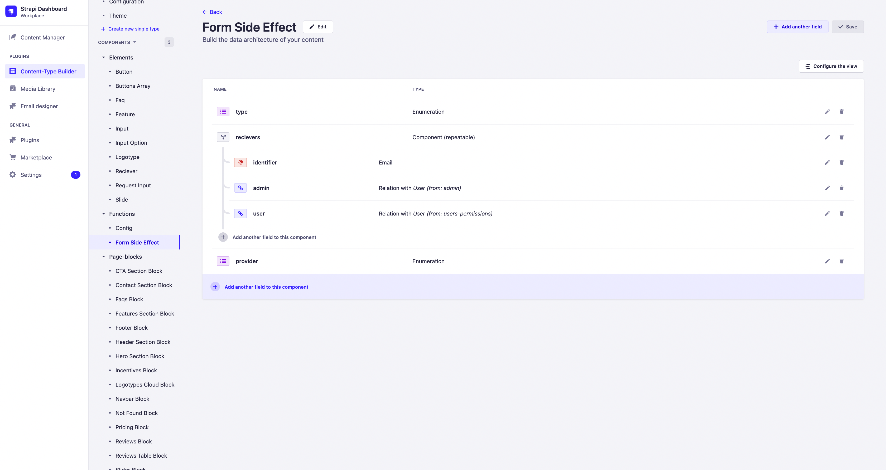

#### Page-blocks

##### CTA Section Block

##### Contact Section Block

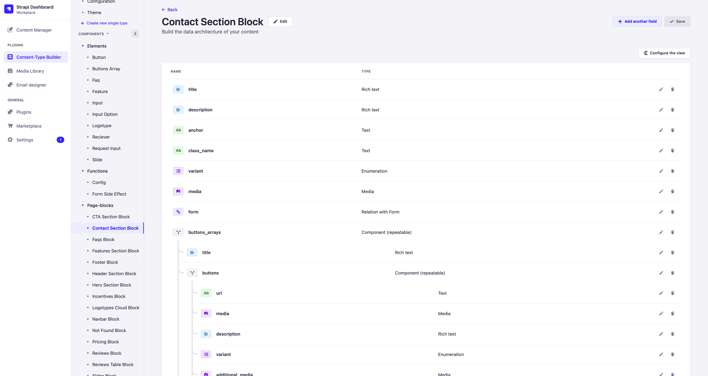

##### Faqs Block

##### Features Section Block

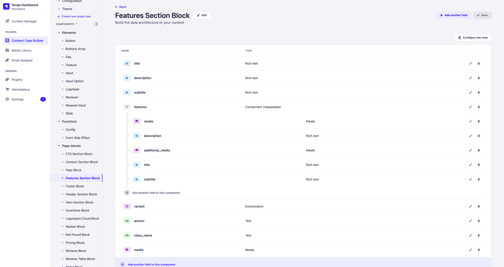

##### Footer Block

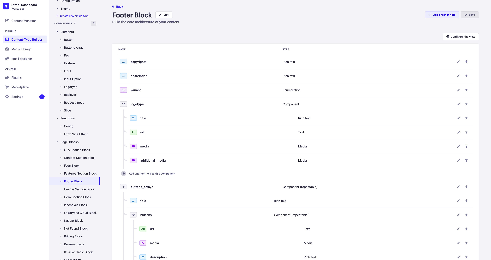

##### Header Section Block

##### Hero Section Block

##### Incentives Block

##### Logotypes Cloud Block

##### Navbar Block

##### Not Found Block

##### Pricing Block

##### Reviews Block

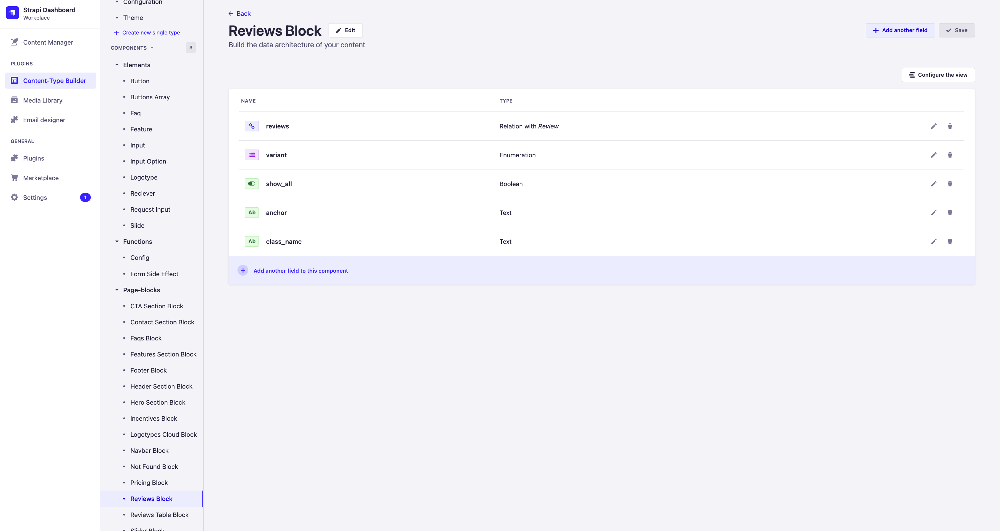

##### Reviews Table Block

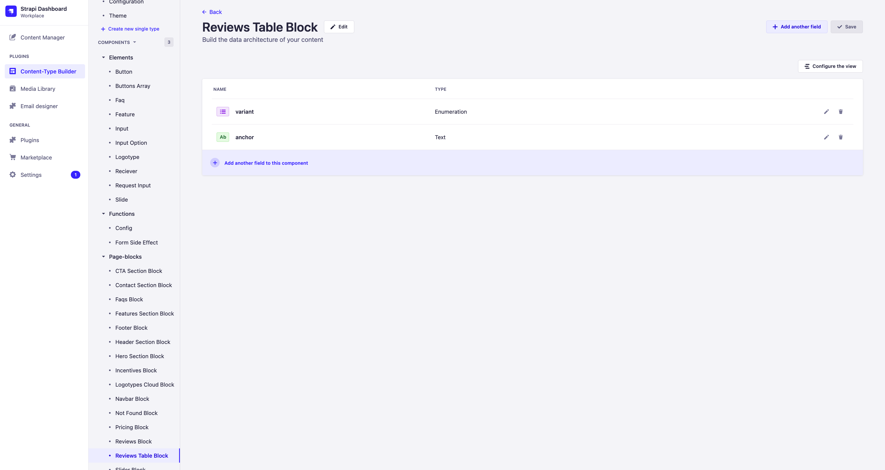

##### Slider Block

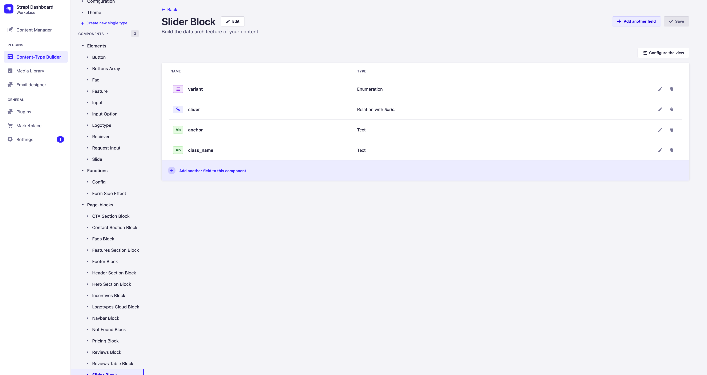
