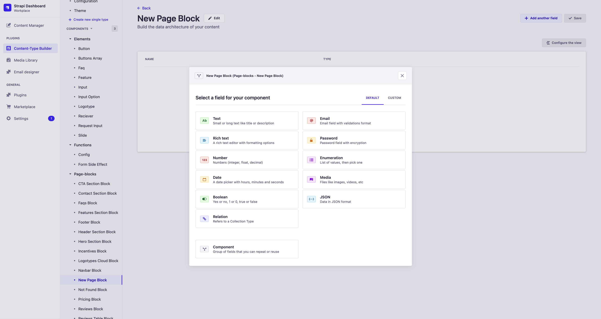
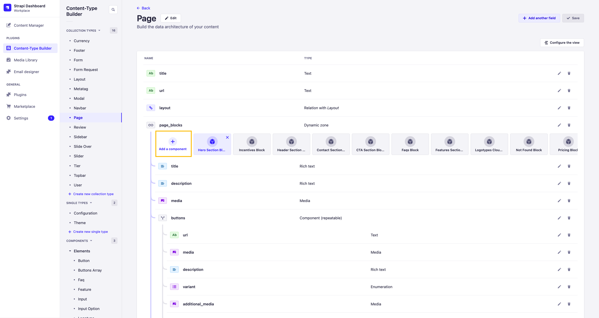
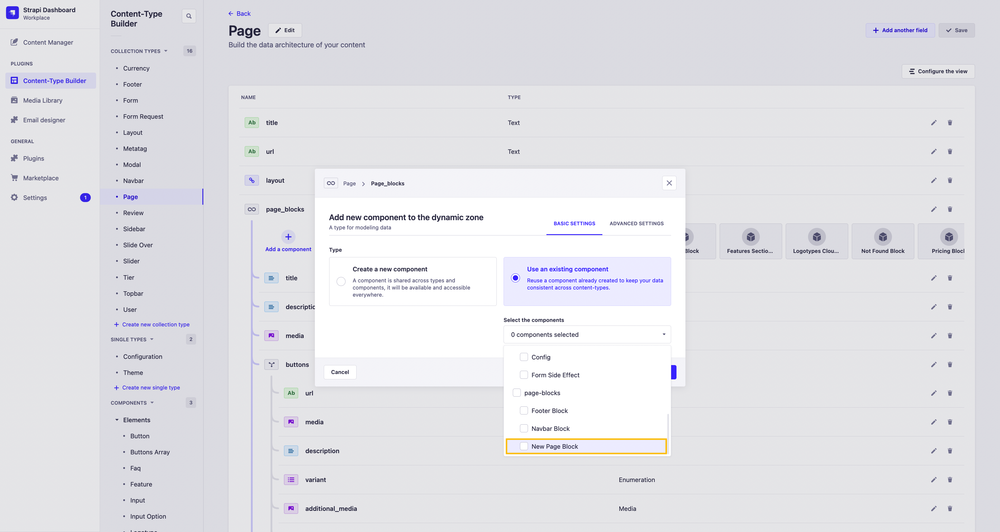

# Работа с Page-Block'ами

Концепция Page-Block'ов предствляет собой способ описания контента и логических элементов на бекенде и передачу их на фронтенд. Все Page-Block'и имеют параметр `variant` на основе этого параметра определяется то, как будет отображаться компонент на фронтенде. Также от этого параметра может зависеть логическая составляющая компонента на фронтенде.

## Данные передаваемые в Page-Block

Каждый Page-Block имеет свой набор необходимых параметров для отображения. Обязательным праметром являет `variant`. Остальные поля могут быть опциональными.

## Создание нового Page-Block

Для создания нового Page-Block нужно перейти в раздел [Content-Type-Builder](http://localhost:1337/admin/plugins/content-type-builder/content-types/api::configuration.configuration) и нажать на кнопку `+ Create new component`.

После чего в открывшемся окне нужно ввести название нового Page-Block'а в формате `New Page Block` и выбрать `page-blocks` в выпадающем списке вариантов.

Затем нужно добавить обязательное `Enumeration` поле с названием `variant`.

После чего можно добавить необходимые поля, если они требуются и сохранить Page-Block, нажав на кнопку `Save`.

## Подключение нового Page-Block к моделям

После того как новый Page-Block создан, необходимо подключить его к модели, например к модели Page. Для этого требуется перейти в раздел [Content-Type-Builder](http://localhost:1337/admin/plugins/content-type-builder/content-types/api::page.page) модели Page и добавить созданный Page-Block в Dynamic-Zone поле `page_blocks`.

Выполнив данные шаги созданный Page-Block станет доступен для выбора в поле `page_blocks` при создании или изменении страницы.

