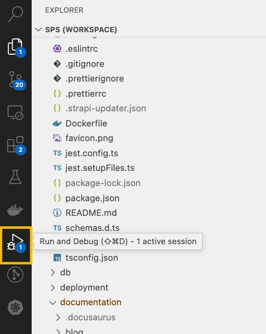

# Install and launch

To run the backend, you need to go to the `backend` directory and execute all the commands and actions specified on this page.

## Environment variables

For the backend to work correctly, you need to set environment variables in the `.env` file.

:::info
For the backend to work correctly, you need to set environment variables in the `.env` file.
:::

For detailed information on available environment variables, refer to the [Official Strapi Documentation](https://docs.strapi.io/dev-docs/configurations).

Below are additional environment variables used in **Single Page Startup**

```txt title=".env"
PROJECT_NAME="Single Page Startup"
SEED_ENTITES=true
MAKE_NEW_SEED=true

EMAIL_PROVIDER=sendpulse
SENDPULSE_USER_ID=XXXXXXXXXXXXXXXXXXXXXXXXXXXXXX
SENDPULSE_USER_SECRET=XXXXXXXXXXXXXXXXXXXXXXXXXXXXXX
SENDPULSE_ADDRESS_BOOK_ID=XXXXXXXX
SENDPULSE_DEFAULT_FROM=no-reply@<yourstartupdomain.com>
SENDPULSE_DEFAULT_REPLY_TO=support@<yourstartupdomain.com>

EMAIL_PROVIDER=amazon-ses
AWS_SES_ACCESS_KEY_ID=secret_key
AWS_SES_ACCESS_SECRET=secret_password
AWS_SES_URL=https://email.amazon_region.amazonaws.com
AWS_SES_DEFAULT_FROM=no-reply@<yourstartupdomain.com>
AWS_SES_DEFAULT_REPLY_TO=support@<yourstartupdomain.com>

AWS_S3_URL=XXXXXXXXX
AWS_S3_ACCESS_KEY_ID=XXXXXXXXXXXXXXXXXX
AWS_S3_ACCESS_SECRET=XXXXXXXXXXXXXXXXXX
AWS_S3_BUCKET=XXXXXXXXX
AWS_S3_REGION=XXXX
AWS_S3_ENDPOINT=XXXXXXXXXXXXXXXXXX
```

We recommend using [managed database hosting providers](https://www.digitalocean.com/products/managed-databases-postgresql) and [S3](https://www.digitalocean.com/products/spaces) for storing files.

This is necessary to create a reliable and fault-tolerant infrastructure, as self-deployed Postgres can become a project failure point. And S3 storage is much cheaper than reserved space on the server.

### Description of Additional Environment Variables

| Name            | Description                                                                                                                                                                                      | Required | Default Value       |
| --------------- | ------------------------------------------------------------------------------------------------------------------------------------------------------------------------------------------------ | -------- | ------------------- |
| PROJECT_NAME    | Project name. This parameter will be set as the sender in emails sent by the Strapi Email plugin.                                                                                                | No       | Single Page Startup |
| SEED_ENTITIES   | Parameter that determines whether data seeding will be done based on the model/seeds/\*.json files.                                                                                              | No       | undefined           |
| MAKE_NEW_SEED   | Parameter that determines whether a data dump will be made based on the data added in the admin panel to the model/seeds/\*.json files. Cannot be called simultaneously with SEED_ENTITIES=true. | No       | undefined           |
| EMAIL_PROVIDER  | Email sending provider used. For more information about possible usage options, see https://docs.strapi.io/dev-docs/plugins/email.                                                               | No       | undefined           |
| SENDPULSE\_\*\* | Configuration parameters for the email provider https://sendpulse.com/.                                                                                                                          | No       | undefined           |
| AWS\_\*\*       | Parameters for configuring S3 storage.                                                                                                                                                           | No       | undefined           |

## Database

For local development, you can use [SQLite](https://docs.strapi.io/dev-docs/configurations/database), or set up a local Postgres instance.

If you choose to use Postgres, you need to run the `docker-compose.db.yaml` file located in the `root` directory of the project. To do this, run the following command:

```bash
docker compose up -f docker-compose.db.yaml up
```

## Launch

To run the backend, you need to execute the command in the `backend` directory.

On the first run:

```bash
npm install && npm run develop
```

On subsequent runs:

```bash
npm run develop
```

## Debug mode

If you are using **VS Code**, you have immediate access to a way to run your project through a debugger. To do this, open the `Run and Debug` tab on the left side of the **VS Code** window.



In the opened window, select `backend` at the top and click on the icon with a triangle. The `Debug console` tab will display information from the web server.


## Admin Panel

After launching the project, an administration panel will be available at [http://127.0.0.1:1337/admin](http://127.0.0.1:1337/admin). Upon first visit, it is necessary to create an administrator.


After creating a user and logging into the account, the Strapi administration panel's home page will open. Detailed information about what Strapi is can be found in the [Official Documentation](https://docs.strapi.io/dev-docs/quick-start).


