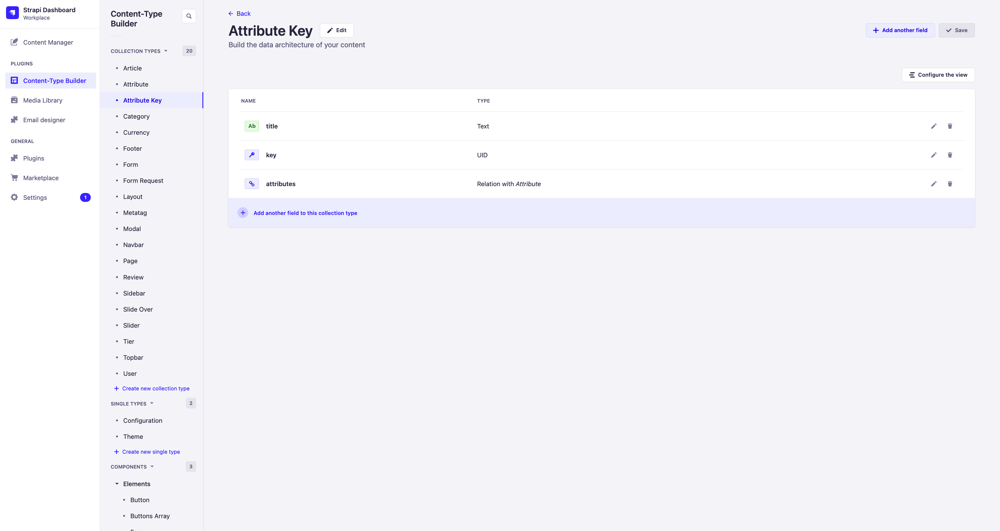
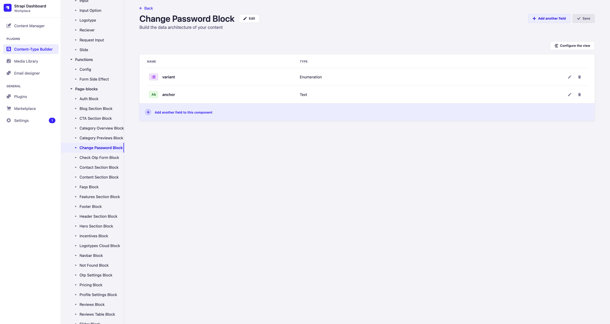
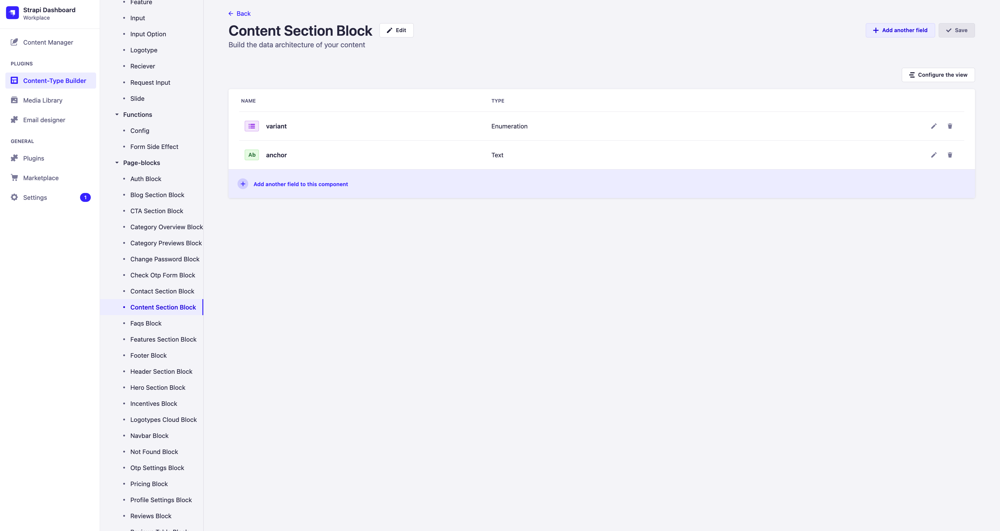
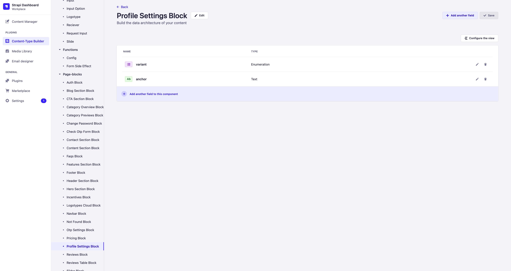

# Модели

Версия `sps` включает в себя все модели `sps-lite`, а также модели, добавляющие логику работы Авторизации, аутентификации и модели связанные с функционалом блога.

## Collection Type

### Article

Модель статьи блога.

### Attribute

Модель атрибута для создания параметров статьи, например времени прочтения.

### Attribute Key

Модель ключа атрибута, в случае создания атрибута времени прочтения это "время прочтения".

### Category

Модель категории.

### User

Расширинная модель пользователя

## Components

### Page-blocks

#### Auth Block

Блок аутентификации и авторизации пользователя

#### Blog Section Block

Блок секции с блогом

#### Category Overview Block

#### Category Previews Block

#### Change Password Block

#### Check Otp Form Block

#### Content Section Block

Контент зона для модели [Article](/docs/backend/what-exists/sps#article)

#### Otp Settings Block

#### Profile Settings Block

