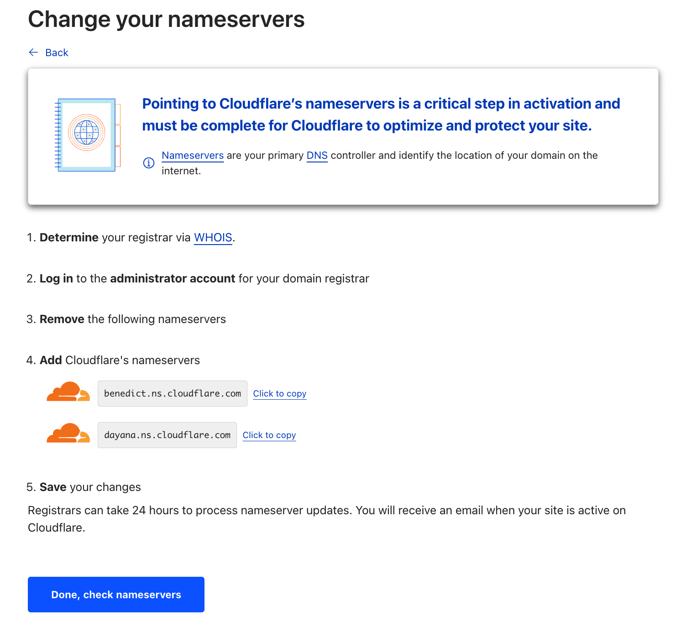
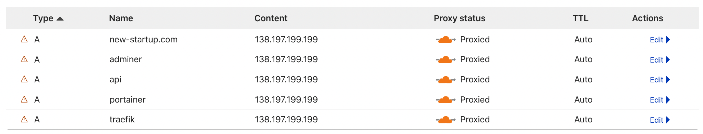
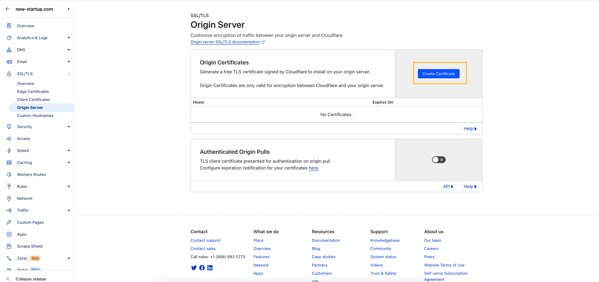

# SSL-cертификаты

Для безопасной работы с проектом необходимо использовать `SSL-сертификаты` для вашего домена.

:::tip
Прежде чем получать сертификаты необхоидмо преобрести домен для своего проекта, это можно сделать на таких сервисах как [Google Domains](https://domains.google/), [Namecheap](https://www.namecheap.com/), [GoDaddy](https://www.godaddy.com/) и других
:::

## Cloudflare

Мы рекомендуем использовать [Cloudflare](https://cloudflare.com/) для работы с `SSL-сертификатами` и `DNS-записями` вашего домена. Для этого вам нужно создать там аккаунт и делегировать домен на их `DNS-серверы`.

Для делегирования вашего домена на серверы **Cloudflare** просто следуйте описанным пунктам в панели администрирования домена **Cloudflare**.

### Добавьте домен

### Выберите Free тариф

### Добавьте nameservers в административной панели, где покупали домен

После завершения нажмите кнопку "Done, check nameservers". Может потребоваться некоторое время, чтобы изменения `NS-серверов` вступили в силу.

После того, как изменения вступят в силу, вы сможете редактировать `DNS-записи` и выдавать `SSL-сертификаты` через **Cloudflare**.

## Добавление DNS-записи

Через **Cloudflare** вы можете управлять `DNS-записями` домена. `DNS-записи` позволяют браузеру определить куда направлять трафик пользователя, когда он пытается постетить ваш проект в интернете.

Необходимо добавить несколько DNS-записей для того, чтобы вашим проектом смогли пользоваться посетители. Нам понадобятся поддомены для **Traefik**, **Portainer**, **Adminer** (по желанию), **Backend**, **Frontend**.

Для этого нужно перейти в раздел **DNS** в сайдбаре панели администрирования **Cloudflare**.

Далее нужно нажать на кнопку "Add record"

После чего нужно добавить несколько записей типа **А** с включенным проксированием через **Cloudflare**. В появившихся полях ввода мы должны вписать название поддомена, на котором хотим видеть тот или иной сервис и `IP адрес сервера`, который мы настраивали в разделе [Сервер](/docs/deployment/server).

:::tip
IP адрес сервера мы вводили в SSH-консоль, поэтому его можно взять оттуда
:::

:::info
При вводе вышеуказанных параметров мы получили следующий результат: мы сказали доменному регистратору что домен управляется **Cloudflare**, поэтому трафик пользователя направляй на NS-серверы **Cloudflare**. А **Cloudflare** мы сказали, что хотим чтобы он при получении запроса от пользователя на получение сайта по адресу `traefik.new-startup.com`, весь трафик направлял на сервер, который находится по `IP-адресу: 138.197.199.199`
:::

Таким же способом добавляем остальные домены.

Для того, чтобы сам домен направить куда-либо в поле ввода **Name (required)** надо ввести `@`

В конечном итоге должны получить примерно такой результат (поддомены могут быть выбраны на усмотрение руководства стартапа):

## Получение SSL-сертификата

После того как мы определили доменный роутинг проекта необходимо получить `SSL-сертификат` и настроить способ его проверки. Для этого нужно перейти в раздел `SSL/TLS`.

Выбираем **Full (strict)**

Переходим в раздел **Origin Server**

Нажимаем **Create certificate**

Подтверждаем создание сертификатов **Create**

Копируем сертификат **Origin Certificate** и сохраняем его содержимое в файл с именем домена и расширением `.crt`, например `new-startup.com.crt`. **Private Key** сохраняем также, только с расширением `.key`. После чего нажимаем **OK**. Впоследствии надо будет разместить эти файлы на сервере в папке `certs`, о ней будет написано в разделе [Docker Swarm](/docs/deployment/swarm).

