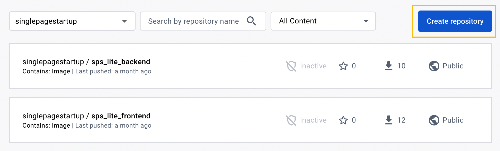
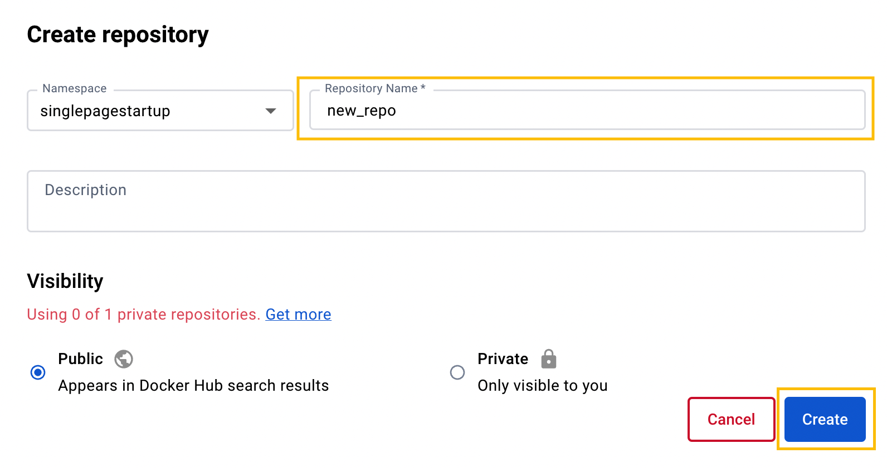
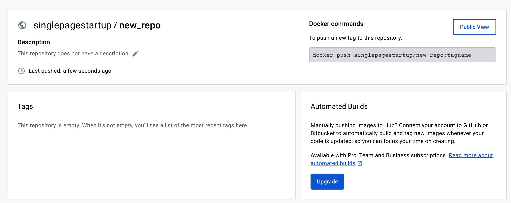

# Docker Images

It is possible to launch a Single Page Startup project using Docker environment and images created based on the `Dockerfile`, located in the `backend` and `frontend` directories.

To successfully execute the following steps, make sure that Docker is installed on the machine where you execute these commands:

```bash title="in any folder"
docker -v
Docker version 20.10.20, build 9fdeb9c
```

## Image Storage System

In order for the server to receive images on the basis of which the frontend and backend containers will be launched, they need to be uploaded to the appropriate system. The most popular of these is [Docker Hub](https://hub.docker.com/).

To upload images to Docker Hub, you need to create an account there and corresponding repositories for the frontend and backend.

After registering with Docker Hub, create a new repository.



Give a name to the repository. In case you are using GitHub Actions that are located in the Single Page Startup, the names of the repositories should follow the following pattern - `<PROJECT_NAME>_<backend|frontend>`.

`PROJECT_NAME` is specified in the GitHub Secrets. The backend project will be built into the `_backend` image, while the frontend will be built into the `_frontend` image.





## Creating and testing images on a local machine

You can create backend and frontend images by running the following commands in the respective directories.

```bash title="in backend folder"
docker build -t backend .
```

```bash title="in frontend folder"
docker build -t frontend .
```

After that, you can launch these data images via the `docker-compose` files located in the `root` directory of the project:

```bash title="in root folder"
docker compose up -f docker-compose.db.yaml up
```

If the images are launched and working properly, they can be uploaded to [Docker Hub](https://hub.docker.com/) or any other similar Docker image storage system.

To do this, you need to have an account in the chosen system, then authenticate your local machine using the `docker login` command. After that, you can upload the created images to the system.

To upload the images, you need to tag the created images according to your account and the created repositories.

```bash
docker image tag <local_image_name> <docker_hub_account>/<repository_name>:<tag>
```

```bash title="in any folder"
docker image tag backend singlepagestartup/new_app_backend:latest
docker image tag frontend singlepagestartup/new_app_frontend:latest
```

If you use a container image storage system other than Docker Hub, you may need to specify the full path to your account. For more information, refer to the [Docker documentation](https://docs.docker.com/engine/reference/commandline/push/#all-tags).

Once your images are tagged, you can push them to the image storage system using a command like this:

```bash
docker image push <docker_hub_account>/<repository_name>:<tag>
```

```bash title="in any folder"
docker image push singlepagestartup/new_app_backend:latest
docker image push singlepagestartup/new_app_frontend:latest
```

We do not recommend creating images on the server, as this consumes a lot of resources. Instead, use GitHub Actions for these purposes. We also provide configurations for using GitHub Actions.

## GitHub Actions

The project created based on Single Page Startup already has files for running GitHub Actions, located in the `.github/workflows` directory. But for them to work correctly, you need to add [Secrets](https://docs.github.com/ru/actions/security-guides/encrypted-secrets) parameters to the GitHub repository settings.

### GitHub Action Secrets

#### DOCKER_HUB_URL

This parameter determines where to send images. You can send images to Docker Hub or use another image storage system.

- `registry.hub.docker.com` - if the upload should be done to [Docker Hub](https://hub.docker.com/)
- `cr.selcloud.ru` - if you have chosen an image storage system from [Selectel](https://selectel.ru/services/cloud/container-registry/)

#### DOCKER_HUB_USERNAME

The directory to which the image will be uploaded. If you are using Docker Hub, this parameter corresponds to the account name. If you have chosen another image storage system, refer to the documentation for that system.

- For Docker Hub, the parameter corresponds to the account login, in the examples above we used `singlepagestartup`
- For other systems, refer to the documentation

#### DOCKER_HUB_LOGIN_USERNAME

The login used for authentication in the system. For Docker Hub, it corresponds to the account login.

#### DOCKER_HUB_PASSWORD

The password for the image storage system. In Docker Hub, it corresponds to the account password.

#### PROJECT_NAME

The name of the project or repository. This parameter is set as part of the future image names. For the frontend, it will be `<PROJECT_NAME>_frontend` and `<PROJECT_NAME>_backend` for the backend. You need to create repositories with these names in the image storage system.

In the examples above, we used `new_app`

We recommend using names corresponding to the repository name in `snake_case`.

#### PORTAINER_STAGING_BACKEND_UPDATE_URL

Link to update the `staging` backend service in [Portainer](https://www.portainer.io/). This parameter can be set after the project is loaded onto the server. Usually, this link looks like `https://<portainer_host.your_domain.com>/<token>`

#### PORTAINER_STAGING_FRONTEND_UPDATE_URL

Link to update the `staging` frontend service in [Portainer](https://www.portainer.io/). This parameter can be set after the project is loaded onto the server. Usually, this link looks like `https://<portainer_host.your_domain.com>/<token>`

If you do not want to use 2 types of environments, then use the `staging` environment as the main one, as it assumes loading and downloading images on the server.

#### PORTAINER_PRODUCTION_BACKEND_UPDATE_URL

Link to update the `production` backend service in [Portainer](https://www.portainer.io/). This parameter can be set after the project is loaded onto the server. This command does not involve creating and uploading images to registries, but only sends a request to Portainer to update the service. Usually, this link looks like `https://<portainer_host.your_domain.com>/<token>`

#### PORTAINER_PRODUCTION_FRONTEND_UPDATE_URL

Link to update the `production` frontend service in [Portainer](https://www.portainer.io/). This parameter can be set after the project is loaded onto the server. This command does not involve creating and uploading images to registries, but only sends a request to Portainer to update the service. Usually, this link looks like `https://<portainer_host.your_domain.com>/<token>`
