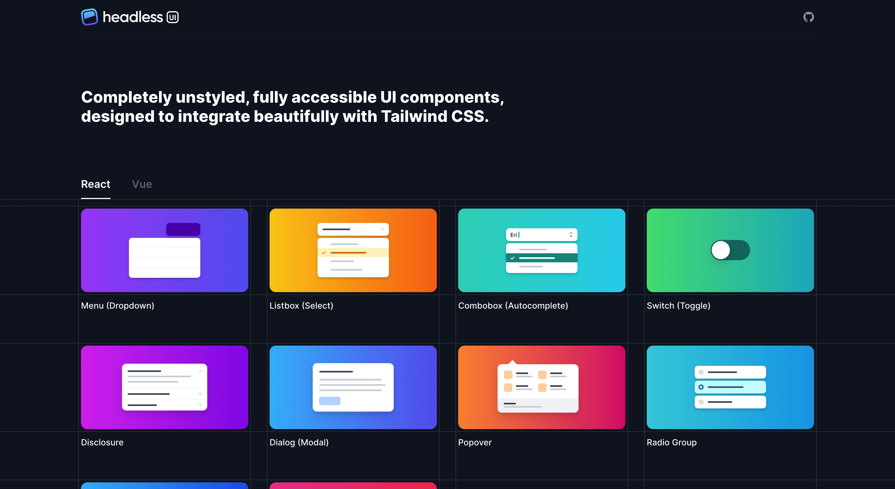
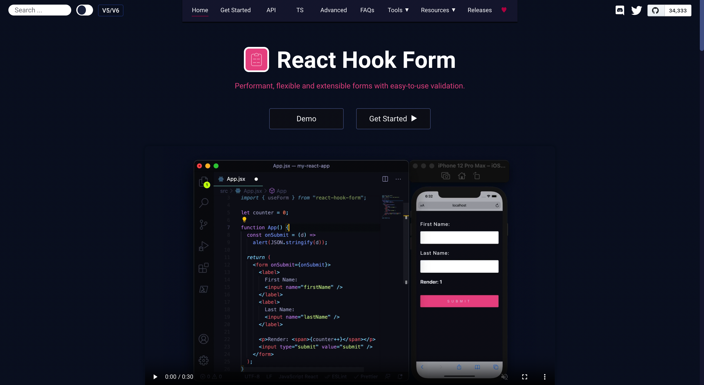
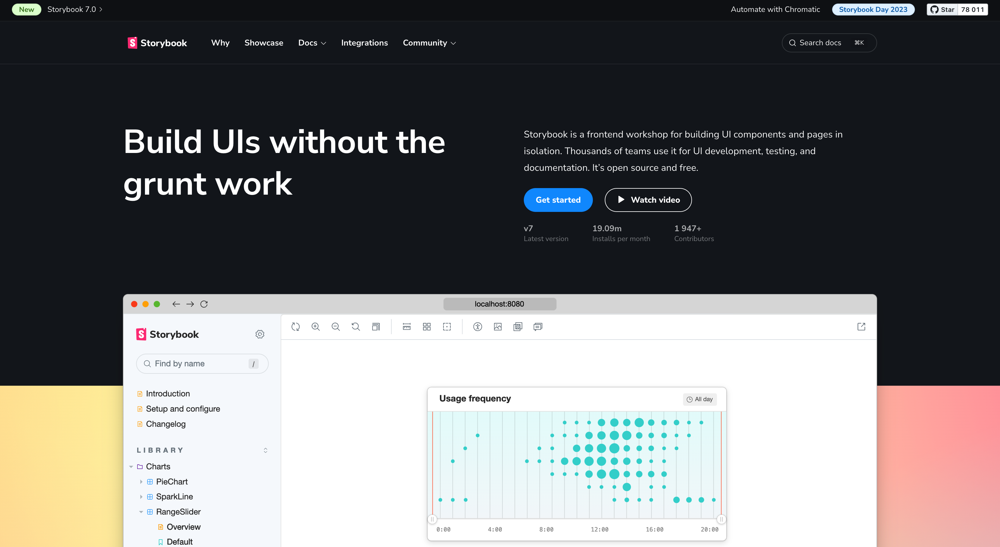

# Фронтенд

Мы выявили список наиболее частоиспользуемых при разработке приложений технологий и объеденили, все они настроены и доступны в Single Page Startup.

## [Next.js](https://nextjs.org/)

Фреймворк для создания интерфейсов на [React.js](https://ru.reactjs.org/) с SSR. Имеет встроенный роутинг, функционал рендеринга на стороне клиента и на сервере, встроенную оптимизацию изображений и многое другое.

## [Redux-Toolkit (RTK)](https://redux-toolkit.js.org/rtk-query/overview)

Официальный набор инструментов для эффективной работы с [Redux](https://redux.js.org/).

## [Headless UI](https://headlessui.com)

Полностью не стилизованные, полностью доступные компоненты пользовательского интерфейса, разработанные для прекрасной интеграции с Tailwind CSS.

## [react-hook-form](https://react-hook-form.com/)

Библиотека для комфорной работы с формами.

## [Tailwind CSS](https://tailwindcss.com/)

Фреймворк для верстки пользовательских интерфейсов на базе классов описывающих один CSS-параметр.

## [Storybook](https://storybook.js.org/)

React.js приложение для отображения частей пользовательского интерфейса в изолированной от основной бизнес логики проекта среде.

## [Playwright](https://playwright.dev/)

Фреймворк для end-to-end тестирования пользовательских приложений.

## [TypeScript](https://typescriptlang.org/)

Строго типизированный язык программирования, основанный на JavaScript, предоставляющий лучшие инструменты для любого масштаба.

